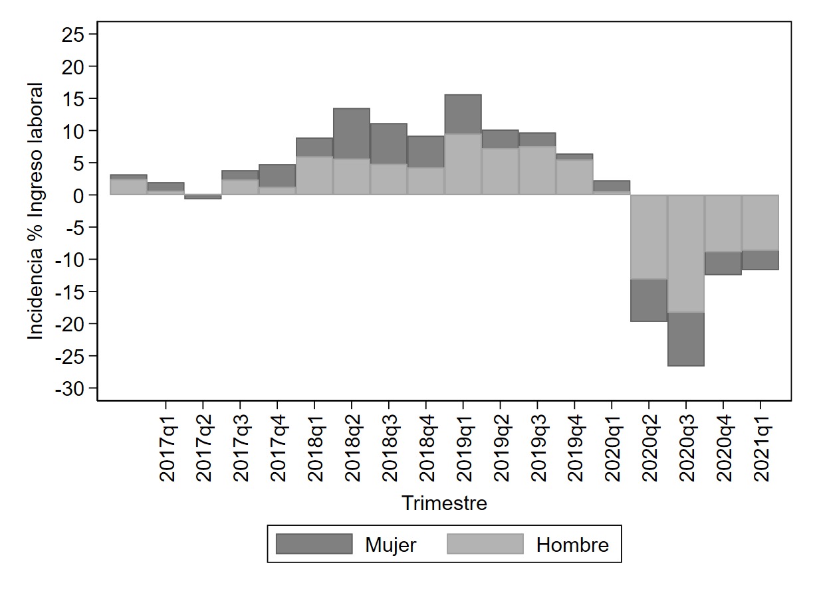

```{r setup, include=FALSE}
library(flexdashboard)
library(dplyr)
library(highcharter)
library(kableExtra)
# Base de datos trimestral
bd <- readxl::read_excel("C:/Users/BECKET/Documents/ARU_2021/pasantia2021/OIT/ECE_dashboard_v1.xlsx", sheet = "ind_trim", range = "A1:U73")
bd$trim <- ifelse(bd$trimestre == 1, "I", 
                  ifelse(bd$trimestre == 2, "II",
                         ifelse(bd$trimestre == 3, "III", "IV")))
bd$ejex <- paste0(bd$trim, " - ", bd$year)
# Base de datos mensual
bd2 <- readxl::read_excel("C:/Users/BECKET/Documents/ARU_2021/pasantia2021/OIT/ECE_dashboard_v1.xlsx", sheet = "ind_month", range = "A1:U217")
bd2$month <- ifelse(bd2$month == 1, "ene", 
             ifelse(bd2$month == 2, "feb",
             ifelse(bd2$month == 3, "mar",
             ifelse(bd2$month == 4, "abr",
             ifelse(bd2$month == 5, "may",
             ifelse(bd2$month == 6, "jun", 
             ifelse(bd2$month == 7, "jul",
             ifelse(bd2$month == 8, "ago",
             ifelse(bd2$month == 9, "sep",
             ifelse(bd2$month == 10, "oct",
             ifelse(bd2$month == 11, "nov", "dic")))))))))))
bd2$ejex <- paste0(bd2$month, " - ", bd2$year)
# Tabla: COVID19
tb1 <- readxl::read_excel("C:/Users/BECKET/Documents/ARU_2021/pasantia2021/OIT/tablas.xlsx", sheet = "tabla1", range = "A1:E16")
# Tabla: Decretos
tb2 <- readxl::read_excel("C:/Users/BECKET/Documents/ARU_2021/pasantia2021/OIT/Decretos_ML_v1.xlsx", sheet = "Mercado Laboral", range = "B5:D17" )
# Base: COVID19
bd3 <- readxl::read_excel("C:/Users/BECKET/Documents/ARU_2021/pasantia2021/OIT/tablas.xlsx", sheet = "graficos", range = "A1:K11")
```

# __Acerca de__ {.sidebar}
=========================================

__OBSERVATORIO DE INDICADORES DE EMPLEO DURANTE LA PANDEMIA POR COVID19__

La Organización Internacional de Trabajo (OIT) apoya al Ministerio de Trabajo, Empleo y Previsión Social a través de Fundación ARU y genera un primer observatorio de indicadores, con el objetivo de hacer seguimiento a estadísticas vitales de empleo bajo la influencia del COVID19.

- __TEMAS__

  + Participación
  + Empleo
  + Desocupación
  + Empleo informal
  + Ingresos laborales
  + Horas de trabajo
  
- Para acceder al contexto haga click [aquí](#Contexto)

- Para acceder al monitoreo COVID19 haga click [aquí](#COVID19)

- Para acceder al anexo estadístico trimestral haga click [aquí](#trim)

- Para acceder al anexo estadístico mensual haga click [aquí](#mens)

- Para acceder a la pestaña de género haga click [aquí](#gen)

- Para acceder a la pestaña de rural haga click [aquí](#rural)

- Para acceder a la pestaña de MyPEs haga click [aquí](#urb)


- __EQUIPO TÉCNICO__
  + Wilson Jiménez
  + Gilmar Belzu
  + Lucila Aguilar
  + Rocio Aruquipa
  + Becket Barragan
  + Sergio Garbay
  + Fabian Calderon
  
- Comentarios son bienvenidos a: [administracion@aru.org.bo](administracion@aru.org.bo) 

{#Inicio data-icon="fa-home"}
=========================================

Row {data-height=150}
-----------------------------------------------------------------------

### __ARU__

```{r  out.width = "50%", out.height = "50%"}
 
```

### __CON EL APOYO DE...__

```{r  out.width = "50%", out.height = "50%"}
 
```

### __OIT__

```{r  out.width = "200%", out.height = "200%"}
 
```

Row {data-height=500}
-----------------------------------------

### __Otro estudios__

- [Efectos de la COVID-19 en la economía rural de América Latina](https://www.ilo.org/americas/publicaciones/WCMS_760656/lang--es/index.htm)

- [ENTORNO MIPYME. Medidas de apoyo a la micro, pequeña y mediana empresa en América Latina y el Caribe frente a la crisis de la COVID-19](https://www.ilo.org/actemp/publications/WCMS_762907/lang--es/index.htm)

- [Respondiendo a las preguntas clave sobre la informalidad en las micro y pequeñas empresas durante la crisis por la COVID-19](https://www.ilo.org/empent/Publications/WCMS_760431/lang--es/index.htm)

- [Aporte para una política de desarrollo productivo con mejores condiciones de salud en el trabajo en Bolivia](https://www.ilo.org/lima/publicaciones/WCMS_806965/lang--es/index.htm)

### __Reglamentación__

- [Decreto Supremo 3567](https://mype-pymes-bolivia.blogspot.com/2018/11/decreto-supremo-3567-reglamentar-la-ley.html#:~:text=Decreto%20Supremo%203567%20-%20Reglamentar%20la%20Ley%20N%C2%B0,como%20establecer%20la%20clasificaci%C3%B3n%20del%20tama%C3%B1o%20de%20empresas.)

- [Ley de Micro y Pequeña Empresa - Ley 947](https://bolivia.infoleyes.com/norma/6453/ley-de-micro-y-peque%C3%B1a-empresa-947)

### __Temáticas abordadas__

- Ocupación

- Desocupación

- Horas de trabajo

- Ingresos mensuales

- Empleo informal

- Género

### __Fuente de información__

- [Encuesta Continua de Empleo (IV - 2015 / III - 2021) del Instituto Nacional de Estadística Bolivia](https://www.ine.gob.bo/index.php/metadatos-y-microdatos/)

__Contexto__{#Contexto}
=========================================

Row
-----------------------------------------

### __Boliva: Tasa de Participación III - 2021__

```{r}
gauge(77.26, min = 0, max = 100, symbol = '%', gaugeSectors(
  success = c(80, 100), warning = c(40, 79), danger = c(0, 39)
))
```

> Fuente: Encuesta Continua de Empleo, INE 2021.

### __Boliva: Tasa de ocupación III - 2021__

```{r}
gauge(73.62, min = 0, max = 100, symbol = '%', gaugeSectors(
  success = c(80, 100), warning = c(40, 79), danger = c(0, 39)
))
```

> Fuente: Encuesta Continua de Empleo, INE 2021.

### __Tasa de desocupación III - 2021__

```{r}
gauge(4.71, min = 0, max = 100, symbol = '%', gaugeSectors(
  success = c(80, 100), warning = c(40, 79), danger = c(0, 39)
))
```

> Fuente: Encuesta Continua de Empleo, INE 2021.

Row
-----------------------------------------

### __Tasa de participación __

Al tercer trimestre de 2021, la tasa de participación fue de __77.26%__, una cifra que se encuentra 3.74 puntos porcentuales por encima del reportado el tercer trimestre de 2019.
  
### __Tasa de ocupación__

Al tercer trimestre de 2021, la tasa de ocupación fue de __73.62%__ (6,318,532 personas), cifra mayor en 2.49 puntos porcentuales al reportado el tercer trimestre de 2019.  

### __Tasa de desocupación__

Al tercer trimestre de 2021, la tasa de desocupación alcanzó a __4.71%__ (311,982 personas), dato que se posiciona 1.46 puntos porcentuales por encima del reportado el tercer trimestre de 2019.  

Row
-----------------------------------------

### Tasa de ocupación

```{r}
valueBox("6630514", caption = "Población económicamente activa", icon="fa-user-o", color="info")
```

### Tasa de ocupación

```{r}
valueBox("6318532", caption = "Población ocupada", icon="fa-users", color="info")
```

### Disminución de ingresos laborales

```{r}
valueBox("311982", caption = "Población desocupada", icon="fa-user", color="success")
```

Row
-----------------------------------------

### __Empleo informal I - 2020__

```{r}
gauge(82.01, min = 0, max = 100, symbol = '%', gaugeSectors(
  success = c(80, 100), warning = c(40, 79), danger = c(0, 39)
))
```

> Fuente: Elaboración propia con base en las ECE. Fundación ARU, 2021.

### __Boliva: Sector informal I - 2020__

```{r}
gauge(78.47, min = 0, max = 100, symbol = '%', gaugeSectors(
  success = c(80, 100), warning = c(40, 79), danger = c(0, 39)
))
```

> Fuente: Elaboración propia con base en las ECE. Fundación ARU, 2021.

### __Horas de trabajo III - 2021__
 
```{r}
valueBox("38.82 horas", caption="Horas de trabajo III - 2021 <br> <br> <br> Fuente: Elaboración Propia con base en las ECE. Fundación ARU, 2021", icon="fa-clock-o", color="info")
```

Row
-----------------------------------------

### __Empleo Informal__

El primer trimestre de 2020 el __82.01%__ de los empleos en Bolivia son informales, cifra que se encuentra 2.33 puntos porcentuales por encima del reportado el primer trimestre de 2019.

### __Sector Informal__

El primer trimestre de 2020 el sector informal en Bolivia asciende a __78.47%__, porcentaje que varia en 1.19 puntos porcentuales en relación al reportado el primer trimestre de 2019.

### __Horas de trabajo__

El tercer trimestre de 2021 en promedio los bolivianos trabajan __39 horas__ a la semana. A diferencia del reportado el tercer trimestre de 2019 con 41 horas semanales.

Row  {data-height=500}
-----------------------------------------

### __BOLIVIA: Población económicamente activa y tasa de participación (en porcentaje), según trimestre__ {data-width=800}

```{r}
cols <- c("#2E4053", "#F4D03F")


highchart(type = "chart") %>% 
  hc_xAxis(categories = bd[bd$desagregacion == "Bolivia", ]$ejex) %>% 
  hc_yAxis_multiples(list(opposite = T, title = list(text = "Tasa de participación (en %)")),
                     list(opposite = F, title = list(text = "Población económicamente activa (en habitantes)"))) %>% 
  hc_add_series(data = as.integer(bd[bd$desagregacion == "Bolivia", ]$pea), type = "column", yAxis = 1, showInLegend = T, name = "Población económicamente activa") %>% 
  hc_add_series(data = round(bd[bd$desagregacion == "Bolivia", ]$tasa_part, 2), type = "spline", yAxis = 0, showInLegend = T, name = "Tasa de participación") %>% 
  hc_add_theme(hc_theme_hcrt() )%>% hc_tooltip(split = T, sort = T) %>%
  hc_plotOptions(line = list(marker = list(lineWidth = 50))) %>% 
  hc_caption(text = "La tasa de participación muestra el porcentaje de la Población Económicamente Activa (PEA) respecto a la Población en Edad de Trabajar (PET). <br> NOTA: Para los trimestres II – 2020, III – 2020 y IV - 2020 el Instituto Nacional de Estadística no publicó la información del área rural, lo que imposibilita tener información para toda Bolivia.") %>% 
  hc_credits(text = "Fuente: Elaboración propia. Fundación ARU, 2021.",
             enabled = T) %>% 
  hc_exporting(filename = "custom-file-name", enabled = T) %>% 
  hc_scrollbar(enabled = F) %>% 
  hc_colors(cols)
```

### __Descripción__ {data-width=200}

Entre el primer trimestre de 2016 y el primer trimestre de 2021, la población económicamente activa tuvo un incremento paulatino. Así mismo, durante el cuarto trimestre de 2019 se observó una caída en la tasa de participación y se recuperó en el siguiente periodo. 


Row  {data-height=500}
-----------------------------------------

### __BOLIVIA: Población ocupada y tasa de ocupación (en porcentaje), según trimestre__ {data-width=800}

```{r}
cols <- substr(viridisLite::viridis(2), 0, 7)

highchart(type = "chart") %>% 
  hc_xAxis(categories = bd[bd$desagregacion == "Bolivia", ]$ejex) %>% 
  hc_yAxis_multiples(list(opposite = T, title = list(text = "Tasa de ocupación (en %)")),
                     list(opposite = F, title = list(text = "Población ocupada (en habitantes)"))) %>% 
  hc_add_series(data = as.integer(bd[bd$desagregacion == "Bolivia", ]$ocupados), type = "column", yAxis = 1, showInLegend = T, name = "Población ocupada") %>% 
  hc_add_series(data = round(bd[bd$desagregacion == "Bolivia", ]$tasa_ocup, 2), type = "spline", yAxis = 0, showInLegend = T, name = "Tasa de ocupación") %>% 
  hc_add_theme(hc_theme_hcrt() )%>% hc_tooltip(split = T, sort = T) %>%
  hc_plotOptions(line = list(marker = list(lineWidth = 50))) %>% 
  hc_caption(text = "La tasa de ocupación muestra el porcentaje de personas que generan bienes y servicios económicos con relación al conjunto de habitantes en edad de trabajar. <br> NOTA: Para los trimestres II – 2020, III – 2020 y IV - 2020 el Instituto Nacional de Estadística no publicó la información del área rural, lo que imposibilita tener información para toda Bolivia.") %>% 
  hc_credits(text = "Fuente: Elaboración propia. Fundación ARU, 2021.",
             enabled = T) %>% 
  hc_exporting(filename = "custom-file-name", enabled = T) %>% 
  hc_scrollbar(enabled = F) %>% 
  hc_colors(cols)
```

### __Descripción__ {data-width=200}

Entre el cuarto trimestre de 2015 y el tercer trimestre de 2019 el número de ocupados se incrementó con un comportamiento estacional en los dos primeros trimestres de cada año (que tiende a disminuir) y en los últimos dos (que tiende a elevsrse). A partir del cuarto trimestre de 2019 se observó una caída en la población ocupada.

Row  {data-height=500}
-----------------------------------------

### __BOLIVIA: Desocupados y tasa de desocupación (en porcentaje), según trimestre__ {data-width=800}

```{r}
cols <- c("#1F618D", "#F4D03F")

highchart(type = "chart") %>% 
  hc_xAxis(categories = bd[bd$desagregacion == "Bolivia", ]$ejex) %>% 
  hc_yAxis_multiples(list(opposite = T, title = list(text = "Tasa de desocupación (en %)")),
                     list(opposite = F, title = list(text = "Población desocupada (en habitantes)"))) %>% 
  hc_add_series(data = as.integer(bd[bd$desagregacion == "Bolivia", ]$pead), type = "column", yAxis = 1, showInLegend = T, name = "Población desocupada") %>% 
  hc_add_series(data = round(bd[bd$desagregacion == "Bolivia", ]$tasa_pead, 2), type = "spline", yAxis = 0, showInLegend = T, name = "Tasa de desocupación") %>% 
  hc_add_theme(hc_theme_hcrt() )%>% hc_tooltip(split = T, sort = T) %>%
  hc_plotOptions(line = list(marker = list(lineWidth = 50))) %>% 
  hc_caption(text = "La tasa de desocupación muestra la relación porcentual de la Población Desocupada (PD) respecto a la Población Económicamente Activa (PEA) y  mide el desempeño del mercado laboral y la economía en su conjunto. Asimismo, es un indicador de la población que no tiene una ocupación, está disponible y busca un trabajo. <br> NOTA: Para los trimestres II – 2020, III – 2020 y IV - 2020 el Instituto Nacional de Estadística no publicó la información.") %>% 
  hc_credits(text = "Fuente: Elaboración propia. Fundación ARU, 2021.",
             enabled = T) %>% 
  hc_exporting(filename = "custom-file-name", enabled = T) %>% 
  hc_scrollbar(enabled = F) %>% 
  hc_colors(cols)
```

### __Descripción__ {data-width=200}

Se observa que la tasa de desocupación entre el cuarto trimestre de 2015 y el tercer trimestre de 2019 varia aproximadamente entre el 3% y 4%. El indicador se incrementa el primer trimestre de cada año, alcanzando su punto más alto el primer trimestre de 2021, con una cifra de 6.26% de la población económicamente activa se encuentra desocupada. 

Row  {data-height=700}
-----------------------------------------

### __BOLIVIA: Ingresos laborales de la actividad principal y remunerados, según trimestre__ {data-width=800}

```{r}
cols <- c("#239B56", "#F39C12")

highchart(type = "chart") %>% 
  hc_xAxis(categories = bd[bd$desagregacion == "Bolivia", ]$ejex) %>% 
  hc_yAxis(title = list(text = "Ingresos laborales promedio (en Bs)")) %>% 
  hc_add_series(data = bd[bd$desagregacion == "Bolivia", ], hcaes(x = ejex, y = round(y_all, 0), group = desagregacion), type = "spline",  showInLegend = T, name = c("Ingresos laborales de la actividad principal")) %>% 
  hc_add_series(data = bd[bd$desagregacion == "Bolivia", ], hcaes(x = ejex, y = round(y_remunerados, 0), group = desagregacion), type = "spline",  showInLegend = T, name = c("Ingresos laborales remunerados")) %>% 
  hc_add_theme(hc_theme_hcrt() )%>% hc_tooltip(split = T, sort = F) %>%
  hc_plotOptions(line = list(marker = list(lineWidth = 50))) %>% 
  hc_caption(text = "NOTA: Para los trimestres II - 2020, III - 2020, IV - 2020  y II - 2021 el Instituto Nacional de Estadística no publicó la información.") %>% 
  hc_credits(text = "Fuente: Elaboración propia con base en las ECE. Fundación ARU, 2021.",
             enabled = T) %>% 
  hc_exporting(filename = "custom-file-name", enabled = T) %>% 
  hc_scrollbar(enabled = F) %>% 
  hc_colors(cols)
```

### __Descripción__ {data-width=200}

En términos nominales, los ingresos laborales por la actividad principal que desempeña la población ocupada __+__  y la población remunerada __++__ presentan una tendencia positiva entre el cuarto trimestre de 2015 y el primer trimestre de 2019. Esta tendencia cambia a partir del segundo trimestre de 2019 hasta el cuarto trimestre de la misma gestión y presenta una  recuperación el primer trimestre de 2020.

 <font size="1">
__+__ La población ocupada se define como toda persona que trabajó al menos una hora en alguna actividad económica la semana anterior al momento de la encuesta.

__++__ La población remunerada son todas aquellas personas ocupadas que recibieron un ingreso por el trabajo que realizaron.
</font> 

Row  {data-height=500}
-----------------------------------------

### __BOLIVIA: Empleo informal y empleo en el sector informal, según trimestre__ {data-width=800}

```{r}
cols <- c("#1F618D ", "#E67E22")

highchart(type = "chart") %>% 
  hc_xAxis(categories = bd[bd$desagregacion == "Bolivia", ]$ejex) %>% 
  hc_yAxis_multiples(list(opposite = F, title = list(text = "En porcentaje"))) %>% 
  hc_add_series(data = round(bd[bd$desagregacion == "Bolivia", ]$emp_informal, 2), type = "spline", yAxis = 0, showInLegend = T, name = "Empleo Informal") %>% 
  hc_add_series(data = round(bd[bd$desagregacion == "Bolivia", ]$sector_informal, 2), type = "spline", yAxis = 0, showInLegend = T, name = "Empleo en el sector informal") %>% 
  hc_add_theme(hc_theme_hcrt() )%>% hc_tooltip(split = T, sort = T) %>%
  hc_plotOptions(line = list(marker = list(lineWidth = 50))) %>% 
  hc_caption(text = "Empleo informal se refiere a los empleados y otros trabajadores sin remuneración que no están afiliados a la AFP, no tienen vacaciones ni licencias por enfermedad y a los empleadores, cooperativistas y los trabajadores por cuenta propia cuya unidad de producción se encuentra en el sector informal u hogares. <br> Empleo en el sector informal de la institución se refiere a aquellas empresas sin contabilidad, sin registro de impuestos, empleados sin afiliación a AFP y sin puestos de trabajo fijos. <br> NOTA: Para los trimestres II – 2020, III – 2020, IV - 2020, I - 2021 Y II - 2021 el Instituto Nacional de Estadística no publicó la información.") %>% 
  hc_credits(text = "Fuente: Elaboración propia. Fundación ARU, 2021.",
             enabled = T) %>% 
  hc_exporting(filename = "custom-file-name", enabled = T) %>% 
  hc_scrollbar(enabled = F) %>% 
  hc_colors(cols)
```

### __Descripción__ {data-width=200}
Se observa un crecimiento paulatino del empleo informal y las ocupaciones en el sector informal entre el segundo trimestre de 2016 y el tercer trimestre de 2019. Esta tendencia fue más pronunciada a partir del cuarto trimestre de 2019 en especial la proporción de empleo informal.  

Row  {data-height=500}
-----------------------------------------
### __BOLIVIA: Horas de trabajo, según trimestre__ {data-width=800}

```{r}
cols <- c("#616A6B")

highchart(type = "chart") %>% 
  hc_xAxis(categories = bd[bd$desagregacion == "Bolivia", ]$ejex) %>% 
  hc_yAxis(title = list(text = "Horas de trabajo promedio a la semana (en horas)")) %>% 
  hc_add_series(data = bd[bd$desagregacion == "Bolivia", ], hcaes(x = ejex, y = round(horas, 1), group = desagregacion), type = "spline",  showInLegend = T, name = c("Bolivia")) %>% 
  hc_add_theme(hc_theme_hcrt() )%>% hc_tooltip(split = T, sort = T) %>%
  hc_plotOptions(line = list(marker = list(lineWidth = 50))) %>% 
  hc_caption(text = "NOTA: Para los trimestres II – 2020, III – 2020 y IV - 2020 el Instituto Nacional de Estadística no publicó la información.") %>% 
  hc_credits(text = "Fuente: Elaboración propia con base en las ECE. Fundación ARU, 2021.",
             enabled = T) %>% 
  hc_exporting(filename = "custom-file-name", enabled = T) %>% 
  hc_scrollbar(enabled = F) %>% 
  hc_colors(cols)
```

### __Descripción__ {data-width=200}

El primer trimestre de 2016 la población ocupada trabaja, en promedio, 44 horas a la semana, cifra que fue disminuyendo paulatinamente. Durante el primer trimestre de 2021, la población reporta que trabaja alrededor de 39 horas a la semana.


__COVID19__{#COVID19}
=======================================================================

Row
-------------------------------------
    
### __NORMATIVA COVID19__
```{r}


#kbl(tb2, col.names = c("Fecha", "Decreto", "Objetivo"), booktabs = T) %>%
 # kable_paper("striped", full_width = F) %>%
  #scroll_box(width = "100%", height = "100%")

url<-c("https://www.lexivox.org/norms/BO-DS-N4196.html",
       "https://www.lexivox.org/norms/BO-DS-N4216.html",
       "https://www.lexivox.org/norms/BO-DS-N4272.html?dcmi_identifier=BO-DS-N4272&format=html",
       "https://www.asfi.gob.bo/images/MARCO_NORMATIVO/SERV_FINAN_/D.S._4295.pdf",
       "https://www.lexivox.org/norms/BO-DS-N4314.html?dcmi_identifier=BO-DS-N4314&format=html",
       "https://www.lexivox.org/norms/BO-DS-N4325.html?dcmi_identifier=BO-DS-N4325&format=html",
       "https://www.lexivox.org/norms/BO-DS-N4364.html?dcmi_identifier=BO-DS-N4364&format=html",
       "https://www.lexivox.org/norms/BO-DS-N4400.xhtml",
       "https://www.lexivox.org/norms/BO-DS-N4422.html?dcmi_identifier=BO-DS-N4422&format=html",
       "https://siip.produccion.gob.bo/repSIIP2/files/normativa_12345_04052021afbf.pdf",
       "https://siip.produccion.gob.bo/repSIIP2/files/normativa_12345_04052021afbf.pdf",
       "http://www.gacetaoficialdebolivia.gob.bo/normas/busquedag1/page:1")
tb2<-tb2 %>%
  mutate(URL = cell_spec(row.names(.), "html", link = url))
kbl(tb2, booktabs = T, format="html", escape = F) %>%
  kable_styling(bootstrap_options = c("hover", "condensed")) %>%
  kable_paper("striped", full_width = F) %>%
  scroll_box(width = "100%", height = "100%")
```

Row {data-height=700, data-width=800}
-----------------------------------------------------------------------

### __Área urbana: Indicadores laborales en periodos seleccionados__ {data-width=800}

```{r}
kbl(tb1, col.names = c("", "", "(%)", "Indicador (t-1)", "Variación (pp)"), booktabs = T) %>%
  kable_paper("striped", full_width = F) %>%
  pack_rows("Tasa de participación global ", 1, 5) %>% 
  pack_rows("Tasa de ocupación", 6, 10) %>%
  pack_rows("Tasa de desocupación", 11, 15) %>% 
  add_header_above(c("Periodo" = 1, "Fecha" = 1, "Indicador" = 1, "Similar periodo un año antes" = 2)) %>% 
  scroll_box(width = "100%", height = "100%")
```

### __Descripción__ {data-width=200}

En el periodo pre-pandemia (enero-marzo 2020) las tasas de participación, ocupación y desocupación en las áreas urbanas permanecieron estables con variaciones poco significativas respecto al mismo periodo del 2019. Durante la cuarentena rígida (abril-mayo de 2020), la tasa de desocupación aumentó 2.4 pp. respecto a similar periodo de 2019. Sin embargo, la mayor elevación del indicador se observó durante la cuarentena dinámica. Se advierte una recuperación de la fuerza laboral en el periodo de post-confinamiento y la segunda ola de contagios.

Row {data-height=500}
-----------------------------------------------------------------------

### __Área urbana: Tasa de participación global __ {data-width=800}

```{r}
cols <- substr(viridisLite::viridis(4), 0, 7)

highchart(type = "chart") %>% 
  hc_xAxis(categories = bd3$periodo) %>% 
  hc_yAxis_multiples(list(opposite = T, title = list(text = "Tasa global de participación (en %)")),
                     list(opposite = F, title = list(text = "Variación (en pp)"))) %>% 
  hc_add_series(data = bd3, hcaes(x = periodo, y = part_t, group = tiempo), type = "column", yAxis = 0, showInLegend = T, name = c("Indicador (t)", "Indicador (t-1)")) %>% 
    hc_add_series(data = bd3, hcaes(x = periodo, y = part_var1, group = tiempo), type = "spline", yAxis = 1, showInLegend = F, name = c("Variación")) %>% 
  hc_add_theme(hc_theme_hcrt() )%>% hc_tooltip(split = F, sort = T) %>%
  hc_plotOptions(line = list(marker = list(lineWidth = 50))) %>% 
  hc_caption(text = "La tasa de participación es el porcentaje de la población económicamente activa sobre la población en edad de trabajar.") %>% 
  hc_credits(text = "Fuente: Elaboración propia. Fundación ARU, 2021.",
             enabled = T) %>% 
  hc_exporting(filename = "custom-file-name", enabled = T) %>% 
  hc_scrollbar(enabled = F) %>% 
  hc_colors(cols)
```

### __Descripción__ {data-width=200}

Entre abril y mayo de 2020 (cuarentena rígida) la tasa de participación disminuyó 8.4 puntos porcentuales respecto al mismo periodo de 2019 y cayó en 5.3 puntos porcentuales entre junio y septiembre de 2020 respecto al mismo periodo de 2019. Se observa una recuperación de la fuerza laboral a partir de octubre de 2020.


Row {data-height=500}
-----------------------------------------------------------------------
### __Área urbana: Tasa de ocupación__ {data-width=800}

```{r}
cols <- substr(viridisLite::viridis(4), 0, 7)

highchart(type = "chart") %>% 
  hc_xAxis(categories = bd3$periodo) %>% 
  hc_yAxis_multiples(list(opposite = T, title = list(text = "Tasa de ocupación (en %)")),
                     list(opposite = F, title = list(text = "Variación (en pp)"))) %>% 
  hc_add_series(data = bd3, hcaes(x = periodo, y = ocup_t, group = tiempo), type = "column", yAxis = 0, showInLegend = T, name = c("Indicador (t)", "Indicador (t-1)")) %>% 
    hc_add_series(data = bd3, hcaes(x = periodo, y = ocup_var1, group = tiempo), type = "spline", yAxis = 1, showInLegend = F, name = c("Variación")) %>% 
  hc_add_theme(hc_theme_hcrt() )%>% hc_tooltip(split = F, sort = T) %>%
  hc_plotOptions(line = list(marker = list(lineWidth = 50))) %>% 
  hc_caption(text = "La tasa de ocupacion muestra el porcentaje de personas que generan bienes y servicios económicos con relación al conjunto de habitantes en edad de trabajar ") %>% 
  hc_credits(text = "Fuente: Elaboración propia. Fundación ARU, 2021.",
             enabled = T) %>% 
  hc_exporting(filename = "custom-file-name", enabled = T) %>% 
  hc_scrollbar(enabled = F) %>% 
  hc_colors(cols)
```

### __Descripción__ {data-width=200}

Entre abril y mayo de 2020 (periodo de la cuarentena rígida), la tasa de ocupación disminuyó 9.3 puntos porcentuales respecto al mismo periodo del año anterior, dicha variación fue de 8.8 pp. entre junio y septiembre de 2020 (cuarentena dinámica) y de 1.4 pp. durante el post-confinamiento. El indicador presenta una leve recuperación el primer trimestre de 2021 (Segunda ola de contagio).

Row {data-height=500}
-----------------------------------------------------------------------
### __Área urbana: Tasa de desocupación__ {data-width=800}

```{r}
cols <- substr(viridisLite::viridis(4), 0, 7)

highchart(type = "chart") %>% 
  hc_xAxis(categories = bd3$periodo) %>% 
  hc_yAxis_multiples(list(opposite = T, title = list(text = "Tasa de desocupación (en %)")),
                     list(opposite = F, title = list(text = "Variación (en pp)"))) %>% 
  hc_add_series(data = bd3, hcaes(x = periodo, y = deso_t, group = tiempo), type = "column", yAxis = 0, showInLegend = T, name = c("Indicador (t)", "Indicador (t-1)")) %>% 
    hc_add_series(data = bd3, hcaes(x = periodo, y = deso_var1, group = tiempo), type = "spline", yAxis = 1, showInLegend = F, name = c("Variación")) %>% 
  hc_add_theme(hc_theme_hcrt() )%>% hc_tooltip(split = F, sort = T) %>%
  hc_plotOptions(line = list(marker = list(lineWidth = 50))) %>% 
  hc_caption(text = "La tasa de desocupación muestra la relación porcentual de la Población Desocupada (PD) respecto a la Población Económicamente Activa (PEA) y  mide el desempeño del mercado laboral y la economía en su conjunto. Asimismo, es un indicador de la población que no tiene una ocupación, está disponible y busca un trabajo.") %>% 
  hc_credits(text = "Fuente: Elaboración propia. Fundación ARU, 2021.",
             enabled = T) %>% 
  hc_exporting(filename = "custom-file-name", enabled = T) %>% 
  hc_scrollbar(enabled = F) %>% 
  hc_colors(cols)
```

### __Descripción__ {data-width=200}

Durante enero y marzo de 2020 la tasa de desocupación disminuyó 0.7 puntos porcentuales respecto al mismo periodo de 2019. A partir de abril de la misma gestión, los niveles de desempleo reportados son mayores en relación al mismo periodo del año anterior. Entre junio y septiembre de 2020 los niveles de desempleo llegan a su punto más alto (10.5%), cifra que representa el doble del reportado el mismo periodo de 2019.


# Participación {#trim data-navmenu="ANEXO TRIMESTRAL" data-icon="fa-list"}

Row {data-height=500}
-----------------------------------------------------------------------

### __BOLIVIA: Población económicamente activa y tasa de participación (en porcentaje), según trimestre__ {data-width=800}

```{r}
cols <- c("#2E4053", "#F4D03F")

highchart(type = "chart") %>% 
  hc_xAxis(categories = bd[bd$desagregacion == "Bolivia", ]$ejex) %>% 
  hc_yAxis_multiples(list(opposite = T, title = list(text = "Tasa de participación (en %)")),
                     list(opposite = F, title = list(text = "Población económicamente activa (en habitantes)"))) %>% 
  hc_add_series(data = as.integer(bd[bd$desagregacion == "Bolivia", ]$pea), type = "column", yAxis = 1, showInLegend = T, name = "Población económicamente activa") %>% 
  hc_add_series(data = round(bd[bd$desagregacion == "Bolivia", ]$tasa_part, 2), type = "spline", yAxis = 0, showInLegend = T, name = "Tasa de participación") %>% 
  hc_add_theme(hc_theme_hcrt() )%>% hc_tooltip(split = T, sort = T) %>%
  hc_plotOptions(line = list(marker = list(lineWidth = 50))) %>% 
  hc_caption(text = "La tasa de participación muestra el porcentaje de la Población Económicamente Activa (PEA) sobre la Población en Edad de Trabajar (PET). <br> NOTA: Para los trimestres II – 2020, III – 2020 y IV - 2020 el Instituto Nacional de Estadística no publicó la información del área rural, lo que imposibilita tener información para toda Bolivia.") %>% 
  hc_credits(text = "Fuente: Elaboración propia. Fundación ARU, 2021.",
             enabled = T) %>% 
  hc_exporting(filename = "custom-file-name", enabled = T) %>% 
  hc_scrollbar(enabled = F) %>% 
  hc_colors(cols)
```

### __Descripción__ {data-width=200}
Entre el primer trimestre de 2016 y el primer trimestre de 2021, la población económicamente activa tuvo un incremento paulatino. Así mismo, durante el cuarto trimestre de 2019 se observó una caída en la tasa de participación y se recuperó en el siguiente periodo.  

Row {data-height=500}
-----------------------------------------------------------------------

### __BOLIVIA: Población económicamente activa y tasa de participación (en porcentje) para el área urbana y rural, según trimestre__ {data-width=800}

```{r}
cols <- substr(viridisLite::cividis(5), 0, 7)

highchart(type = "chart") %>% 
  hc_xAxis(categories = bd[bd$desagregacion == "Urbano" | bd$desagregacion == "Rural", ]$ejex) %>% 
  hc_yAxis_multiples(list(opposite = T, title = list(text = "Tasa de participación (en %)")),
                     list(opposite = F, title = list(text = "Población económicamente activa (en habitantes)"))) %>% 
  hc_add_series(data = bd[bd$desagregacion == "Urbano" | bd$desagregacion == "Rural", ], hcaes(x = ejex, y = as.integer(pea), group = desagregacion), type = "column", yAxis = 1, showInLegend = T, name = c("Población económicamente activa en área rural", "Población económicamente activa en área urbana")) %>% 
  hc_add_series(data = bd[bd$desagregacion == "Urbano" | bd$desagregacion == "Rural", ], hcaes(x = ejex, y = round(tasa_part, 2), group = desagregacion), type = "spline", yAxis = 0, showInLegend = T, name = c("Tasa de participación rural", "Tasa de participación urbana")) %>% 
  hc_add_theme(hc_theme_hcrt() )%>% hc_tooltip(split = T, sort = F) %>%
  hc_plotOptions(line = list(marker = list(lineWidth = 50))) %>% 
  hc_caption(text = "La tasa de participación muestra el porcentaje de la Población Económicamente Activa (PEA) sobre la Población en Edad de Trabajar (PET). <br> NOTA: Para los trimestres II – 2020, III – 2020 y IV - 2020 del área rural el Instituto Nacional de Estadística no publicó la información.") %>% 
  hc_credits(text = "Fuente: Elaboración propia. Fundación ARU, 2021.",
             enabled = T) %>% 
  hc_exporting(filename = "custom-file-name", enabled = T) %>% 
  hc_scrollbar(enabled = F) %>% 
  hc_colors(cols)
```

### __Descripción__ {data-width=200}
Los niveles de participación en áreas rurales y urbanas presentan un crecimiento entre el cuarto trimestre de 2015 y el tercer trimestre de 2019. En áreas rurales, la tasa de participación continuó incrementando en periodos posteriores, caso contrario a la participación en áreas urbanas, indicador que disminuyó entre el cuarto trimestre de 2019 y el segundo trimestre de 2020 y muestra una recuperación a partir del tercer trimestre de 2020.    

# Ocupación {data-navmenu="ANEXO TRIMESTRAL" data-icon="fa-list"}

Row {data-height=500}
-----------------------------------------------------------------------

### __BOLIVIA: Población ocupada y tasa de ocupación (en porcentaje), según trimestre__ {data-width=800}

```{r}
cols <- substr(viridisLite::viridis(2), 0, 7)

highchart(type = "chart") %>% 
  hc_xAxis(categories = bd[bd$desagregacion == "Bolivia", ]$ejex) %>% 
  hc_yAxis_multiples(list(opposite = T, title = list(text = "Tasa de ocupación (en %)")),
                     list(opposite = F, title = list(text = "Población ocupada (en habitantes)"))) %>% 
  hc_add_series(data = as.integer(bd[bd$desagregacion == "Bolivia", ]$ocupados), type = "column", yAxis = 1, showInLegend = T, name = "Población ocupada") %>% 
  hc_add_series(data = round(bd[bd$desagregacion == "Bolivia", ]$tasa_ocup, 2), type = "spline", yAxis = 0, showInLegend = T, name = "Tasa de ocupación") %>% 
  hc_add_theme(hc_theme_hcrt() )%>% hc_tooltip(split = T, sort = F) %>%
  hc_plotOptions(line = list(marker = list(lineWidth = 50))) %>% 
  hc_caption(text = "La tasa de ocupación muestra el porcentaje de personas que generan bienes y servicios económicos con relación al conjunto de habitantes en edad de trabajar. <br> NOTA: Para los trimestres II – 2020, III – 2020 y IV - 2020 el Instituto Nacional de Estadística no publicó la información del área rural, lo que imposibilita tener información para toda Bolivia.") %>% 
  hc_credits(text = "Fuente: Elaboración propia. Fundación ARU, 2021.",
             enabled = T) %>% 
  hc_exporting(filename = "custom-file-name", enabled = T) %>% 
  hc_scrollbar(enabled = F) %>% 
  hc_colors(cols)
```

### __Descripción__ {data-width=200}

Entre el cuarto trimestre de 2015 y el tercer trimestre de 2019 el número de ocupados se incrementó con un comportamiento estacional en los dos primeros trimestres de cada año (que tiende a disminuir) y en los últimos dos (que tiende a elevsrse). A partir del cuarto trimestre de 2019 se observó una caída en la población ocupada. 

Row {data-height=500}
-----------------------------------------------------------------------

### __BOLIVIA: Población ocupada y tasa de ocupación (en porcentaje) para el área urbana y rural, según trimestre__ {data-width=800}

```{r}
cols <- substr(viridisLite::cividis(5), 0, 7)

highchart(type = "chart") %>% 
  hc_xAxis(categories = bd[bd$desagregacion == "Urbano" | bd$desagregacion == "Rural", ]$ejex) %>% 
  hc_yAxis_multiples(list(opposite = T, title = list(text = "Tasa de ocupación (en %)")),
                     list(opposite = F, title = list(text = "Población ocupada (en habitantes)"))) %>% 
  hc_add_series(data = bd[bd$desagregacion == "Urbano" | bd$desagregacion == "Rural", ], hcaes(x = ejex, y = as.integer(ocupados), group = desagregacion), type = "column", yAxis = 1, showInLegend = T, name = c("Ocupados en área rural", "Ocupados en área urbana")) %>% 
  hc_add_series(data = bd[bd$desagregacion == "Urbano" | bd$desagregacion == "Rural", ], hcaes(x = ejex, y = round(tasa_ocup, 2), group = desagregacion), type = "spline", yAxis = 0, showInLegend = T, name = c("Tasa de ocupación rural", "Tasa de ocupación urbana")) %>% 
  hc_add_theme(hc_theme_hcrt() )%>% hc_tooltip(split = T, sort = F) %>%
  hc_plotOptions(line = list(marker = list(lineWidth = 50))) %>% 
  hc_caption(text = "La tasa de ocupación muestra el porcentaje de personas que generan bienes y servicios económicos con relación al conjunto de habitantes en edad de trabajar. <br> NOTA: Para los trimestres II – 2020, III – 2020 y IV - 2020 del área rural el Instituto Nacional de Estadística no publicó la información.") %>% 
  hc_credits(text = "Fuente: Elaboración propia. Fundación ARU, 2021.",
             enabled = T) %>% 
  hc_exporting(filename = "custom-file-name", enabled = T) %>% 
  hc_scrollbar(enabled = F) %>% 
  hc_colors(cols)
```

### __Descripción__ {data-width=200}

En las áreas rurales,  los niveles de ocupación son mayores respecto a los niveles reportados en las áreas urbanas, cifras que se incrementaron paulatinamente. Los niveles de ocupación en las áreas urbanas presentan una disminución a partir del tercer trimestre de 2019, conducta que fue más pronunciada el segundo trimestre de 2020. A partir del tercer trimestre de 2020 se observa una recuperación en el indicador.  


Row {data-height=800}
-----------------------------------------------------------------------

### __Área urbana: Distribución de la población ocupada por actividad económica (en porcentaje), según trimestre.__ {data-width=800}

```{r}
cols <- substr(viridisLite::cividis(5), 0, 7)
highchart(type = "chart") %>% 
  hc_xAxis(categories = bd[bd$desagregacion == "Urbano", ]$ejex) %>% 
  hc_yAxis_multiples(list(opposite = F, title = list(text = "Población ocupada según actividad económica (en %)"))) %>% 
  hc_add_series(data = bd[bd$desagregacion == "Urbano", ], hcaes(x = ejex, y = round(agricultura,2), group = desagregacion), type = "column", yAxis = 0, showInLegend = T, name = c("Ocupados en agricultura")) %>% 
  hc_add_series(data = bd[bd$desagregacion == "Urbano", ], hcaes(x = ejex, y = round(industria, 2), group = desagregacion), type = "column", yAxis = 0, showInLegend = T, name = c("Ocupados en industria")) %>% 
  hc_add_series(data = bd[bd$desagregacion == "Urbano", ], hcaes(x = ejex, y = round(servicios, 2), group = desagregacion), type = "column", yAxis = 0, showInLegend = T, name = c("Ocupados en servicios")) %>%
  hc_add_series(data = bd[bd$desagregacion == "Urbano", ], hcaes(x = ejex, y = round(otros_c, 2), group = desagregacion), type = "column", yAxis = 0, showInLegend = T, name = c("Otros")) %>%
  hc_add_theme(hc_theme_hcrt() )%>% hc_tooltip(split = T, sort = F) %>%
  hc_plotOptions(series = list(stacking = "normal")) %>% 
  hc_caption(text = "NOTA: Los datos corresponden al área urbana de Bolivia. Para el trimestre II – 2021 y III - 2021 el Instituto Nacional de Estadística no publicó la información de ocupados en servicios y otros.") %>% 
  hc_credits(text = "Fuente: Elaboración propia. Fundación ARU, 2021.",
             enabled = T) %>% 
  hc_exporting(filename = "custom-file-name", enabled = T) %>% 
  hc_scrollbar(enabled = F) %>% 
  hc_colors(cols)
```

### __Descripción__ {data-width=200}
Durante el periodo analizado, se observan cambios poco significativos en la distribución de la población ocupada según actividad económica. El porcentaje de ocupados en agricultura en el segundo trimestre de 2021 fue de 5.59%, cifra que aumentó en 0.16 puntos porcentuales respecto al reportado el segundo trimestre de 2020. El porcentaje de ocupados en industria en el segundo trimestre de 2021 es de 13.91%, cifra que es 1.14 puntos porcentuales menos en relación al reportado el segundo trimestre de 2020. En cuanto al porcentaje de ocupados en servicios y otros, las cifras al cuarto trimestre de 2020 son de 62.45% y 17.42% respectivamente, mostrando una variación de – 0.67 y 0.09 puntos porcentuales en relación a las cifras reportadas el cuarto trimestre de 2019. 

Row {data-height=500}
-----------------------------------------------------------------------

### __Área urbana: Empleo-equivalente a tiempo completo por categoría ocupacional, según trimestre.__ {data-width=800}

```{r}
cols <- c("#2980B9", "#CD6155", "#616A6B")

highchart(type = "chart") %>% 
  hc_xAxis(categories = bd[bd$desagregacion == "Urbano", ]$ejex) %>% 
  hc_yAxis_multiples(list(opposite = F, title = list(text = "Población ocupada según categoria ocupacional (en miles)"))) %>% 
  hc_add_series(data = bd[bd$desagregacion == "Urbano", ], hcaes(x = ejex, y = round(asalariado), group = desagregacion), type = "column", yAxis = 0, showInLegend = T, name = c("Asalariados")) %>% 
  hc_add_series(data = bd[bd$desagregacion == "Urbano", ], hcaes(x = ejex, y = round(cuenta_p), group = desagregacion), type = "column", yAxis = 0, showInLegend = T, name = c("Cuenta Propia")) %>% 
  hc_add_series(data = bd[bd$desagregacion == "Urbano", ], hcaes(x = ejex, y = round(otros), group = desagregacion), type = "column", yAxis = 0, showInLegend = T, name = c("Otros")) %>%
  hc_add_theme(hc_theme_hcrt() )%>% hc_tooltip(split = T, sort = F) %>%
  hc_plotOptions(series = list(stacking = "normal")) %>% 
  hc_caption(text = "NOTA: Los datos corresponden al área urbana de Bolivia.") %>% 
  hc_credits(text = "Fuente: Elaboración propia. Fundación ARU, 2021.",
             enabled = T) %>% 
  hc_exporting(filename = "custom-file-name", enabled = T) %>% 
  hc_scrollbar(enabled = F) %>% 
  hc_colors(cols)
```

### __Descripción__ {data-width=200}

En las tres categorías ocupacionales, el empleo equivalente a tiempo completo tuvo una caída a partir del segundo trimestre de 2020. Sin embargo, la magnitud de empleos equivalentes a tiempo completo se recuperaron  a partir del cuarto trimestre de 2020. 

# Informalidad {data-navmenu="ANEXO TRIMESTRAL" data-icon="fa-list"}

Row {data-height=500}
-----------------------------------------------------------------------

### __BOLIVIA: Empleo Informal y empleo en el Sector Informal, según trimestre__ {data-width=800}

```{r}
cols <- c("#1F618D ", "#E67E22")

highchart(type = "chart") %>% 
  hc_xAxis(categories = bd[bd$desagregacion == "Bolivia", ]$ejex) %>% 
  hc_yAxis_multiples(list(opposite = F, title = list(text = "Empleo informal y empleo en el sector informal (en %)"))) %>% 
  hc_add_series(data = round(bd[bd$desagregacion == "Bolivia", ]$emp_informal, 2), type = "spline", yAxis = 0, showInLegend = T, name = "Empleo Informal") %>% 
  hc_add_series(data = round(bd[bd$desagregacion == "Bolivia", ]$sector_informal, 2), type = "spline", yAxis = 0, showInLegend = T, name = "Empleo en el sector informal") %>% 
  hc_add_theme(hc_theme_hcrt() )%>% hc_tooltip(split = T, sort = T) %>%
  hc_plotOptions(line = list(marker = list(lineWidth = 50))) %>% 
  hc_caption(text = "Empleo informal se refiere a los empleados y otros trabajadores sin remuneración que no están afiliados a la AFP, no tienen vacaciones ni licencias por enfermedad y a los empleadores, cooperativistas y trabajadores por cuenta propia cuya unidad de producción se encuentra en el sector informal u hogares. <br> Empleo en el sector informal de la institución se refiere a aquellas empresas sin contabilidad, sin registro de impuestos, empleados sin afiliación a AFP y sin puestos de trabajo fijos. <br> NOTA: Para los trimestres II – 2020, III – 2020, IV - 2020, I - 2021 Y II - 2021 el Instituto Nacional de Estadística no publicó la información ") %>% 
  hc_credits(text = "Fuente: Elaboración propia. Fundación ARU, 2021.",
             enabled = T) %>% 
  hc_exporting(filename = "custom-file-name", enabled = T) %>% 
  hc_scrollbar(enabled = F) %>% 
  hc_colors(cols)
```

### __Descripción__ {data-width=200}

Se observa un crecimiento paulatino del empleo y el sector informal entre el segundo trimestre de 2016 y el tercer trimestre de 2019. Esta tendencia fue más pronunciada a partir del cuarto trimestre de 2019 en especial en el indicador del empleo informal.  

Row {data-height=500}
-----------------------------------------------------------------------

### __BOLIVIA: Empleo Informal y empleo en el Sector Informal para el área urabana y rural, según trimestre__ {data-width=800}

```{r}
cols <- substr(viridisLite::cividis(5), 0, 7)

highchart(type = "chart") %>% 
  hc_xAxis(categories = bd[bd$desagregacion == "Urbano" | bd$desagregacion == "Rural", ]$ejex) %>% 
  hc_yAxis_multiples(list(opposite = F, title = list(text = "Empleo Informal y empleo en el sector informal(en %)"))) %>% 
  hc_add_series(data = bd[bd$desagregacion == "Urbano" | bd$desagregacion == "Rural", ], hcaes(x = ejex, y = round(emp_informal, 2), group = desagregacion), type = "spline", yAxis = 0, showInLegend = T, name = c("Empleo Informal en área rural", "Empleo Informal en área urbana")) %>% 
  hc_add_series(data = bd[bd$desagregacion == "Urbano" | bd$desagregacion == "Rural", ], hcaes(x = ejex, y = round(sector_informal, 2), group = desagregacion), type = "spline", yAxis = 0, showInLegend = T, name = c("Empleo en el sector informal en área rural", "Empleo en el sector informal en área urbana")) %>% 
  hc_add_theme(hc_theme_hcrt() )%>% hc_tooltip(split = T, sort = F) %>%
  hc_plotOptions(line = list(marker = list(lineWidth = 50))) %>% 
  hc_caption(text = "Empleo informal se refiere a los empleados y otros trabajadores sin remuneración que no están afiliados a la AFP, no tienen vacaciones ni licencias por enfermedad y a los empleadores, cooperativistas y trabajadores por cuenta propia cuya unidad de producción se encuentra en el sector informal u hogares. <br> Empleo en el sector informal de la institución se refiere a aquellas empresas sin contabilidad, sin registro de impuestos, empleados sin afiliación a AFP y sin puestos de trabajo fijos. <br> NOTA: Para los trimestres II – 2020, III – 2020, IV - 2020, I - 2021 y II 2021 el Instituto Nacional de Estadística no publicó la información") %>% 
  hc_credits(text = "Fuente: Elaboración propia. Fundación ARU, 2021.",
             enabled = T) %>% 
  hc_exporting(filename = "custom-file-name", enabled = T) %>% 
  hc_scrollbar(enabled = F) %>% 
  hc_colors(cols)
```

### __Descripción__ {data-width=200}
Se observa que en general el sector informal y la cantidad de empleos informales predomina en las áreas rurales. Entre el cuarto trimestre de 2015 y el segundo trimestre de 2019 la cantidad de empleos informales muestra un leve decrecimiento en áreas rurales, tendencia que cambia a partir de tercer trimestre de 2019. La cantidad de empleos informales en áreas urbanas sigue una tendencia similar, con la diferencia que la tendencia cambia a partir del primer trimestre de 2019. 

# Desocupación {data-navmenu="ANEXO TRIMESTRAL" data-icon="fa-list"}

Row {data-height=500}
-----------------------------------------------------------------------

### __BOLIVIA: Población desocupada y tasa de desocupación (en porcentaje), según trimestre__ {data-width=800}

```{r}
cols <- c("#1F618D", "#F4D03F")

highchart(type = "chart") %>% 
  hc_xAxis(categories = bd[bd$desagregacion == "Bolivia", ]$ejex) %>% 
  hc_yAxis_multiples(list(opposite = T, title = list(text = "Tasa de desocupación (en %)")),
                     list(opposite = F, title = list(text = "Población desocupada (en habitantes)"))) %>% 
  hc_add_series(data = as.integer(bd[bd$desagregacion == "Bolivia", ]$pead), type = "column", yAxis = 1, showInLegend = T, name = "Población desocupada") %>% 
  hc_add_series(data = round(bd[bd$desagregacion == "Bolivia", ]$tasa_pead, 2), type = "spline", yAxis = 0, showInLegend = T, name = "Tasa de desocupación") %>% 
  hc_add_theme(hc_theme_hcrt() )%>% hc_tooltip(split = T, sort = T) %>%
  hc_plotOptions(line = list(marker = list(lineWidth = 50))) %>% 
  hc_caption(text = "La tasa de desocupación muestra la relación porcentual de la Población Desocupada (PD) respecto a la Población Económicamente Activa (PEA) y  mide el desempeño del mercado laboral y la economía en su conjunto. Asimismo, es un indicador de la población que no tiene una ocupación, está disponible y busca un trabajo. <br> NOTA: Para los trimestres II – 2020, III – 2020 y IV - 2020 el Instituto Nacional de Estadística no publicó la información.") %>% 
  hc_credits(text = "Fuente: Elaboración propia. Fundación ARU, 2021.",
             enabled = T) %>% 
  hc_exporting(filename = "custom-file-name", enabled = T) %>% 
  hc_scrollbar(enabled = F) %>% 
  hc_colors(cols)
```

### __Descripción__ {data-width=200}

Se observa que el número de personas desocupadas en Bolivia se acentúa el primer trimestre de cada año, periodo en el cual la tasa de desocupación se sitúa alrededor del 4%. El primer trimestre de 2021 el indicador llega a su punto más alto, donde el 6.26% de la población económicamente activa se encuentra desocupada.

Row {data-height=500}
-----------------------------------------------------------------------

### __BOLIVIA: Población desocupada y tasa de desocupación (en porcentaje) para el área urbana y rural, según trimestre__ {data-width=800}

```{r}
cols <- substr(viridisLite::cividis(5), 0, 7)

highchart(type = "chart") %>% 
  hc_xAxis(categories = bd[bd$desagregacion == "Urbano" | bd$desagregacion == "Rural", ]$ejex) %>% 
  hc_yAxis_multiples(list(opposite = T, title = list(text = "Tasa de desocupación (en %)")),
                     list(opposite = F, title = list(text = "Población desocupada (en habitantes)"))) %>% 
  hc_add_series(data = bd[bd$desagregacion == "Urbano" | bd$desagregacion == "Rural", ], hcaes(x = ejex, y = as.integer(pead), group = desagregacion), type = "column", yAxis = 1, showInLegend = T, name = c("Desocupados en área rural", "Desocupados en área urbana")) %>% 
  hc_add_series(data = bd[bd$desagregacion == "Urbano" | bd$desagregacion == "Rural", ], hcaes(x = ejex, y = round(tasa_pead, 2), group = desagregacion), type = "spline", yAxis = 0, showInLegend = T, name = c("Tasa de desocupación rural", "Tasa de desocupación urbana")) %>% 
  hc_add_theme(hc_theme_hcrt() )%>% hc_tooltip(split = T, sort = F) %>%
  hc_plotOptions(line = list(marker = list(lineWidth = 50))) %>% 
  hc_caption(text = "La tasa de desocupación muestra la relación porcentual de la Población Desocupada (PD) respecto a la Población Económicamente Activa (PEA) que mide el desempeño del mercado laboral y la economía en su conjunto. Asimismo, mide la utilización de la mano de obra en el mercado laboral y el fracaso de encontrar un trabajo. <br> NOTA: Para los trimestres II – 2020, III – 2020, IV - 2020, I - 2021 y II - 2021 del área rural el Instituto Nacional de Estadística no publicó la información.") %>% 
  hc_credits(text = "Fuente: Elaboración propia. Fundación ARU, 2021.",
             enabled = T) %>% 
  hc_exporting(filename = "custom-file-name", enabled = T) %>% 
  hc_scrollbar(enabled = F) %>% 
  hc_colors(cols)
```

### __Descripción__ {data-width=200}

Los niveles de desocupación en las áreas urbanas en promedio son mayores en relación a los niveles reportados en las áreas rurales. A partir del cuarto trimestre de 2019, los niveles de desocupación en las áreas urbanas presentan una tendencia creciente, indicador que llega a su punto más alto el tercer trimestre de 2020 (10.8%) El indicador muestra una disminución a partir del cuarto trimestre de 2020. 

# Ingresos {data-navmenu="ANEXO TRIMESTRAL" data-icon="fa-list"}

Row {data-height=600}
-----------------------------------------------------------------------

### __BOLIVIA: Ingresos laborales de la actividad principal y remunerados, según trimestre__ {data-width=800}

```{r}
cols <- c("#239B56", "#F39C12")

highchart(type = "chart") %>% 
  hc_xAxis(categories = bd[bd$desagregacion == "Bolivia", ]$ejex) %>% 
  hc_yAxis(title = list(text = "Ingresos laborales promedio (en Bs)")) %>% 
  hc_add_series(data = bd[bd$desagregacion == "Bolivia", ], hcaes(x = ejex, y = round(y_all, 0), group = desagregacion), type = "spline",  showInLegend = T, name = c("Ingresos laborales de la actividad principal")) %>% 
  hc_add_series(data = bd[bd$desagregacion == "Bolivia", ], hcaes(x = ejex, y = round(y_remunerados, 0), group = desagregacion), type = "spline",  showInLegend = T, name = c("Ingresos laborales remunerados")) %>% 
  hc_add_theme(hc_theme_hcrt() )%>% hc_tooltip(split = T, sort = F) %>%
  hc_plotOptions(line = list(marker = list(lineWidth = 50))) %>% 
  hc_caption(text = "NOTA: Para los trimestres II - 2020, III - 2020, IV - 2020 y II - 2021 el Instituto Nacional de Estadística no publicó la información.") %>% 
  hc_credits(text = "Fuente: Elaboración propia con base en las ECE. Fundación ARU, 2021.",
             enabled = T) %>% 
  hc_exporting(filename = "custom-file-name", enabled = T) %>% 
  hc_scrollbar(enabled = F) %>% 
  hc_colors(cols)
```

### __Descripción__ {data-width=200}
 
En términos nominales, los ingresos laborales por la actividad principal que desempeña la población ocupada __+__  y la población remunerada __++__ presentan una tendencia positiva entre el cuarto trimestre de 2015 y el primer trimestre de 2019. Esta tendencia cambia a partir del segundo trimestre de 2019 hasta el cuarto trimestre de la misma gestión y presenta una  recuperación el primer trimestre de 2020.

 <font size="1">
__+__ La población ocupada se define como toda persona que trabajó al menos una hora en alguna actividad económica la semana anterior al momento de la encuesta.

__++__ La población remunerada son todas aquellas personas ocupadas que recibieron un ingreso por el trabajo que realizaron.
</font>  

Row {data-height=800}
-----------------------------------------------------------------------

### __BOLIVIA: Ingresos laborales de la actividad principal y remunerados para el área urbana y rural, según trimestre__ {data-width=800}

```{r}
cols <- substr(viridisLite::cividis(5), 0, 7)

highchart(type = "chart") %>% 
  hc_xAxis(categories = bd[bd$desagregacion == "Urbano" | bd$desagregacion == "Rural", ]$ejex) %>% 
  hc_yAxis_multiples(list(opposite = F, title = list(text = "Ingresos laborales de la actividad principal y remunerados (en bs.)"))) %>% 
  hc_add_series(data = bd[bd$desagregacion == "Urbano" | bd$desagregacion == "Rural", ], hcaes(x = ejex, y = round(y_all, 2), group = desagregacion), type = "spline", yAxis = 0, showInLegend = T, name = c("Ingresos laborales de la actividad principal en área rural", "Ingresos laborales de la actividad principal en área urbana")) %>% 
  hc_add_series(data = bd[bd$desagregacion == "Urbano" | bd$desagregacion == "Rural", ], hcaes(x = ejex, y = round(y_remunerados, 2), group = desagregacion), type = "spline", yAxis = 0, showInLegend = T, name = c("Ingresos laborales remunerados en área rural", "Ingresos laborales remunerados en área urbana")) %>% 
  hc_add_theme(hc_theme_hcrt() )%>% hc_tooltip(split = T, sort = F) %>%
  hc_plotOptions(line = list(marker = list(lineWidth = 50))) %>% 
  hc_caption(text = "NOTA: Para los trimestres II – 2020, III – 2020, IV - 2020, I - 2021, II - 2021 del área rural y I - 2021, II - 2021 del área urbana el Instituto Nacional de Estadística no publicó la información. <br> *La población ocupada se define como toda persona que por lo menos trabajó una hora en alguna actividad económica la semana anterior. <br> **La población remunerada son todas aquellas personas ocupadas que tienen un ingreso mayor a cero.") %>% 
  hc_credits(text = "Fuente: Elaboración propia. Fundación ARU, 2021.",
             enabled = T) %>% 
  hc_exporting(filename = "custom-file-name", enabled = T) %>% 
  hc_scrollbar(enabled = F) %>% 
  hc_colors(cols)
```

### __Descripción__ {data-width=200}

En terminos nominales, los ingresos laborales por la actividad principal que desempeña la población ocupada __+__ y la población remunerada __++__ del área urbana y rural presentan una tendencia positiva entre el cuarto trimestre de 2015 y el primer trimestre de 2019, tendencia que cambió a partir del segundo trimestre de 2019.  Los ingresos de la población ocupada del área rural presentan una ligera recuperación el primer trimestre de 2020; en cambio, los ingresos laborales de la población ocupada del área urbana continúan disminuyendo, conducta que es más pronunciada el segundo y tercer trimestre de 2020.

<font size="1">
__+__ La población ocupada se define como toda persona que por lo menos trabajó una hora en alguna actividad económica la semana anterior.

__++__ La población remunerada son todas aquellas personas ocupadas que tienen un ingreso mayor a cero.
</font> 

# Horas {data-navmenu="ANEXO TRIMESTRAL" data-icon="fa-list"}

Row {data-height=500}
-----------------------------------------------------------------------

### __BOLIVIA: Horas de trabajo, según trimestre__ {data-width=800}
```{r}
cols <- c("#616A6B")

highchart(type = "chart") %>% 
  hc_xAxis(categories = bd[bd$desagregacion == "Bolivia", ]$ejex) %>% 
  hc_yAxis(title = list(text = "Horas de trabajo promedio a la semana (en horas)")) %>% 
  hc_add_series(data = bd[bd$desagregacion == "Bolivia", ], hcaes(x = ejex, y = round(horas, 1), group = desagregacion), type = "spline",  showInLegend = T, name = c("Bolivia")) %>% 
  hc_add_theme(hc_theme_hcrt() )%>% hc_tooltip(split = T, sort = T) %>%
  hc_plotOptions(line = list(marker = list(lineWidth = 50))) %>% 
  hc_caption(text = "NOTA: Para los trimestres II – 2020, III – 2020 y IV - 2020 el Instituto Nacional de Estadística no publicó la información del área rural, lo que imposibilita tener información para toda Bolivia.") %>% 
  hc_credits(text = "Fuente: Elaboración propia con base en las ECE. Fundación ARU, 2021.",
             enabled = T) %>% 
  hc_exporting(filename = "custom-file-name", enabled = T) %>% 
  hc_scrollbar(enabled = F) %>% 
  hc_colors(cols)
```

### __Descripción__ {data-width=200}
El primer trimestre de 2016 la población ocupada en promedio trabaja 44 horas a la semana, cifra que ha ido disminuyendo paulatinamente. El primer trimestre de 2021 la población reporta que trabaja alrededor de 39 horas a la semana.


Row {data-height=500}
-----------------------------------------------------------------------

### __BOLIVIA: Horas de trabajo para el área urbana y rural, según trimestre__ {data-width=800}

```{r}
cols <- c("#616A6B", "#FFA07A")

highchart(type = "chart") %>% 
  hc_xAxis(categories = bd[bd$desagregacion == "Rural" | bd$desagregacion == "Urbano", ]$ejex) %>% 
  hc_yAxis(title = list(text = "Horas de trabajo promedio a la semana (en horas)")) %>% 
  hc_add_series(data = bd[bd$desagregacion == "Rural" | bd$desagregacion == "Urbano", ], hcaes(x = ejex, y = round(horas, 1), group = desagregacion), type = "spline",  showInLegend = T, name = c("Rural", "Urbano")) %>% 
  hc_add_theme(hc_theme_hcrt() )%>% hc_tooltip(split = T, sort = F) %>%
  hc_plotOptions(line = list(marker = list(lineWidth = 50))) %>% 
  hc_caption(text = "NOTA: Para los trimestres II – 2020, III – 2020 y IV - 2020 del área rural el Instituto Nacional de Estadística no publicó la información.") %>% 
  hc_credits(text = "Fuente: Elaboración propia con base en las ECE. Fundación ARU, 2021.",
             enabled = T) %>% 
  hc_exporting(filename = "custom-file-name", enabled = T) %>% 
  hc_scrollbar(enabled = F) %>% 
  hc_colors(cols)
```

### __Descripción__ {data-width=200}
En promedio los trabajadores del área urbana tienden a trabajar más horas a la semana en comparación con aquellos que se desempeñan en áreas rurales. Entre el cuarto trimestre de 2015 y el primer trimestre de 2020, ambas cifras presentan una tendencia decreciente; sin embargo, a partir del tercer trimestre de 2020 se observa un incremento del indicador en áreas urbanas. 

# Participación {#mens data-navmenu="ANEXO MENSUAL" data-icon="fa-list"}

Row {data-height=500}
-----------------------------------------------------------------------

### __BOLIVIA: Población económicamente activa y tasa de participación (en porcentaje), según mes__ {data-width=800}

```{r}
cols <- c("#2E4053", "#F4D03F")

highchart(type = "chart") %>% 
  hc_xAxis(categories = bd2[bd2$desagregacion == "Bolivia", ]$ejex) %>% 
  hc_yAxis_multiples(list(opposite = T, title = list(text = "Tasa de participación (en %)")),
                     list(opposite = F, title = list(text = "Población económicamente activa (en habitantes)"))) %>% 
  hc_add_series(data = as.integer(bd2[bd2$desagregacion == "Bolivia", ]$pea), type = "column", yAxis = 1, showInLegend = T, name = "Población económicamente activa") %>% 
  hc_add_series(data = round(bd2[bd2$desagregacion == "Bolivia", ]$tasa_part, 2), type = "spline", yAxis = 0, showInLegend = T, name = "Tasa de participación") %>% 
  hc_add_theme(hc_theme_hcrt() )%>% hc_tooltip(split = T, sort = T) %>%
  hc_plotOptions(line = list(marker = list(lineWidth = 50))) %>% 
  hc_caption(text = "La tasa de participación muestra el porcentaje de la Población Económicamente Activa (PEA) sobre la Población en Edad de Trabajar (PET). <br> NOTA: Para los meses octubre, noviembre y diciembre de 2020 el Instituto Nacional de Estadística no publicó la información del área rural, lo que imposibilita tener información para toda Bolivia.") %>% 
  hc_credits(text = "Fuente: Elaboración propia. Fundación ARU, 2021.",
             enabled = T) %>% 
  hc_exporting(filename = "custom-file-name", enabled = T) %>% 
  hc_scrollbar(enabled = F) %>% 
  hc_colors(cols)
```

### __Descripción__ {data-width=200}
La tasa de participación entre 2015 y 2018 ha ido incrementando paulatinamente. Este comportamiento cambió a partir de agosto de 2019, donde la tasa de participación presenta una caída (con excepción de diciembre de 2019 y enero de 2020) y una mejora en los primeros meses de 2021.

Row {data-height=500}
-----------------------------------------------------------------------

### __BOLIVIA: Población económicamente activa y tasa de participación (en porcentaje) para el área urbana y rural, según mes__ {data-width=800}

```{r}
cols <- substr(viridisLite::cividis(5), 0, 7)

highchart(type = "chart") %>% 
  hc_xAxis(categories = bd2[bd2$desagregacion == "Urbano" | bd2$desagregacion == "Rural", ]$ejex) %>% 
  hc_yAxis_multiples(list(opposite = T, title = list(text = "Tasa de participación (en %)")),
                     list(opposite = F, title = list(text = "Población económicamente activa (en habitantes)"))) %>% 
  hc_add_series(data = bd2[bd2$desagregacion == "Urbano" | bd2$desagregacion == "Rural", ], hcaes(x = ejex, y = as.integer(pea), group = desagregacion), type = "column", yAxis = 1, showInLegend = T, name = c("Población económicamente activa en área rural", "Población económicamente activa en área urbana")) %>% 
  hc_add_series(data = bd2[bd2$desagregacion == "Urbano" | bd2$desagregacion == "Rural", ], hcaes(x = ejex, y = round(tasa_part, 2), group = desagregacion), type = "spline", yAxis = 0, showInLegend = T, name = c("Tasa de participación rural", "Tasa de participación urbana")) %>% 
  hc_add_theme(hc_theme_hcrt() )%>% hc_tooltip(split = T, sort = F) %>%
  hc_plotOptions(line = list(marker = list(lineWidth = 50))) %>% 
  hc_caption(text = "La tasa de participación muestra el porcentaje de la Población Económicamente Activa (PEA) sobre la Población en Edad de Trabajar (PET). <br> NOTA: Para los meses abril, mayo, junio, julio, agosto, septiembre, octubre, noviembre y diciembre de 2020 del área rural el Instituto Nacional de Estadística no publicó la información.") %>% 
  hc_credits(text = "Fuente: Elaboración propia. Fundación ARU, 2021.",
             enabled = T) %>% 
  hc_exporting(filename = "custom-file-name", enabled = T) %>% 
  hc_scrollbar(enabled = F) %>% 
  hc_colors(cols)
```

### __Descripción__ {data-width=200}
La tasa de participación en áreas urbanas y rurales presenta un crecimiento paulatino entre 2015 y 2019. A partir de marzo de 2020 se observa un decrecimiento en el indicador en áreas urbanas y una recuperación del mismo desde julio de 2020.

# Ocupación {data-navmenu="ANEXO MENSUAL" data-icon="fa-list"}


Row {data-height=500}
-----------------------------------------------------------------------

### __BOLIVIA: Población ocupada y tasa de ocupación (en porcentaje), según mes__ {data-width=800}

```{r}
cols <- substr(viridisLite::viridis(2), 0, 7)

highchart(type = "chart") %>% 
  hc_xAxis(categories = bd2[bd2$desagregacion == "Bolivia", ]$ejex) %>% 
  hc_yAxis_multiples(list(opposite = T, title = list(text = "Tasa de ocupación (en %)")),
                     list(opposite = F, title = list(text = "Población ocupada (en habitantes)"))) %>% 
  hc_add_series(data = as.integer(bd2[bd2$desagregacion == "Bolivia", ]$ocupados), type = "column", yAxis = 1, showInLegend = T, name = "Población ocupada") %>% 
  hc_add_series(data = round(bd2[bd2$desagregacion == "Bolivia", ]$tasa_ocup, 2), type = "spline", yAxis = 0, showInLegend = T, name = "Tasa de ocupación") %>% 
  hc_add_theme(hc_theme_hcrt() )%>% hc_tooltip(split = T, sort = T) %>%
  hc_plotOptions(line = list(marker = list(lineWidth = 50))) %>% 
  hc_caption(text = "La tasa de ocupación muestra el porcentaje de personas que generan bienes y servicios económicos con relación al conjunto de habitantes en edad de trabajar. <br> NOTA: Para los meses abril, mayo, junio, julio, agosto, septiembre, octubre, noviembre y diciembre de 2020 el Instituto Nacional de Estadística no publicó la información del área rural, lo que imposibilita tener información para toda Bolivia.") %>% 
  hc_credits(text = "Fuente: Elaboración propia. Fundación ARU, 2021.",
             enabled = T) %>% 
  hc_exporting(filename = "custom-file-name", enabled = T) %>% 
  hc_scrollbar(enabled = F) %>% 
  hc_colors(cols)
```

### __Descripción__ {data-width=200}

Entre el 2015 y 2018, la tasa de ocupación tiende a presentar caídas en los primeros dos meses del año y una recuperación en los siguientes periodos. Este comportamiento cambió a partir de noviembre de 2019, donde la tasa mensual de ocupación presenta una caída alrededor de 2 puntos porcentuales. El indicador mejora en los primeros meses de 2021.

Row {data-height=500}
----------------------------------------------------------------------

### __BOLIVIA: Población ocupada y tasa de ocupación (en porcentaje) para el área urbana y rural, según mes__ {data-width=800}

```{r}
cols <- substr(viridisLite::viridis(4), 0, 7)

highchart(type = "chart") %>% 
  hc_xAxis(categories = bd2[bd2$desagregacion == "Urbano" | bd2$desagregacion == "Rural", ]$ejex) %>% 
  hc_yAxis_multiples(list(opposite = T, title = list(text = "Tasa de ocupación (en %)")),
                     list(opposite = F, title = list(text = "Población ocupada (en habitantes)"))) %>% 
  hc_add_series(data = bd2[bd2$desagregacion == "Urbano" | bd2$desagregacion == "Rural", ], hcaes(x = ejex, y = as.integer(ocupados), group = desagregacion), type = "column", yAxis = 1, showInLegend = T, name = c("Ocupados en área rural", "Ocupados en área urbana")) %>% 
  hc_add_series(data = bd2[bd2$desagregacion == "Urbano" | bd2$desagregacion == "Rural", ], hcaes(x = ejex, y = round(tasa_ocup, 2), group = desagregacion), type = "spline", yAxis = 0, showInLegend = T, name = c("Tasa de ocupación rural", "Tasa de ocupación urbana")) %>% 
  hc_add_theme(hc_theme_hcrt() )%>% hc_tooltip(split = T, sort = F) %>%
  hc_plotOptions(line = list(marker = list(lineWidth = 50))) %>% 
  hc_caption(text = "La tasa de ocupación muestra el porcentaje de personas que generan bienes y servicios económicos con relación al conjunto de habitantes en edad de trabajar. <br> NOTA: Para los meses abril, mayo, junio, julio, agosto, septiembre, octubre, noviembre y diciembre de 2020 del área rural el Instituto Nacional de Estadística no publicó la información.") %>% 
  hc_credits(text = "Fuente: Elaboración propia. Fundación ARU, 2021.",
             enabled = F) %>% 
  hc_exporting(filename = "custom-file-name", enabled = T) %>% 
  hc_scrollbar(enabled = F) %>% 
  hc_colors(cols)
```

### __Descripción__ {data-width=200}

La tasa de ocupación en áreas rurales presenta un crecimiento paulatino entre 2015 y 2018; a partir de noviembre de 2018 se observa un decrecimiento en el indicador y una recuperación desde febrero de 2019. En las áreas urbanas el indicador presenta un crecimiento entre 2015 y 2019, tendencia que cambió entre enero y mayo de 2020 y una recuperación a partir de junio de 2020

Row {data-height=700}
-----------------------------------------------------------------------

### __Área urbana: Distribución de la población ocupada por actividad (en porcentaje) económica, según mes.__ {data-width=800}

```{r}
cols <- substr(viridisLite::cividis(5), 0, 7)

highchart(type = "chart") %>% 
  hc_xAxis(categories = bd2[bd2$desagregacion == "Urbano", ]$ejex) %>% 
  hc_yAxis_multiples(list(opposite = F, title = list(text = "Población ocupada según actividad económica (en %)"))) %>% 
  hc_add_series(data = bd2[bd2$desagregacion == "Urbano", ], hcaes(x = ejex, y = round(agricultura,2), group = desagregacion), type = "column", yAxis = 0, showInLegend = T, name = c("Ocupados en agricultura")) %>% 
  hc_add_series(data = bd2[bd2$desagregacion == "Urbano", ], hcaes(x = ejex, y = round(industria, 2), group = desagregacion), type = "column", yAxis = 0, showInLegend = T, name = c("Ocupados en industria")) %>% 
  hc_add_series(data = bd2[bd2$desagregacion == "Urbano", ], hcaes(x = ejex, y = round(servicios, 2), group = desagregacion), type = "column", yAxis = 0, showInLegend = T, name = c("Ocupados en servicios")) %>%
  hc_add_theme(hc_theme_hcrt() )%>% hc_tooltip(split = T, sort = F) %>%
  hc_add_series(data = bd2[bd2$desagregacion == "Urbano", ], hcaes(x = ejex, y = round(otros_c, 2), group = desagregacion), type = "column", yAxis = 0, showInLegend = T, name = c("Otros")) %>%
  hc_add_theme(hc_theme_hcrt() )%>% hc_tooltip(split = T, sort = F) %>%
  hc_plotOptions(series = list(stacking = "normal")) %>% 
  hc_caption(text = "NOTA: Los datos corresponden al área urbana de Bolivia. Para los meses de abril, mayo, junio de 2021 el Instituto Nacional de Estadística no publicó la información.") %>% 
  hc_credits(text = "Fuente: Elaboración propia. Fundación ARU, 2021.",
             enabled = T) %>% 
  hc_exporting(filename = "custom-file-name", enabled = T) %>% 
  hc_scrollbar(enabled = F) %>% 
  hc_colors(cols)
```

### __Descripción__ {data-width=200}

Entre octubre de 2015 y enero de 2021 se observa que no hubo mucha variación en cuanto a la distribución de la población ocupada en las cuatro actividades económicas. El porcentaje de ocupados en agricultura en diciembre de 2020 es de 5.75%, cifra que es 0.65 puntos porcentuales mayor en relación al reportado en diciembre de 2019. El porcentaje de ocupados en industria es de 13.36%, cifra que es 0.47 puntos porcentuales menor al reportado en diciembre de 2019. En cuanto al porcentaje de ocupados en servicios y otros, las cifras a diciembre de 2020 son de 62.83% y 17.79% respectivamente, mostrando una variación de 0.25 y -0.7 puntos porcentuales en relación a las cifras reportadas en diciembre de 2019.

Row {data-height=700}
-----------------------------------------------------------------------

### __Área urbana: Empleo-equivalente a tiempo completo por categoría ocupacional, según trimestre., según mes.__ {data-width=800}

```{r}
cols <- c("#2980B9", "#CD6155", "#616A6B")

highchart(type = "chart") %>% 
  hc_xAxis(categories = bd2[bd2$desagregacion == "Urbano", ]$ejex) %>% 
  hc_yAxis_multiples(list(opposite = F, title = list(text = "Población ocupada según categoria ocupacional (en miles)"))) %>% 
  hc_add_series(data = bd2[bd2$desagregacion == "Urbano", ], hcaes(x = ejex, y = round(asalariado), group = desagregacion), type = "column", yAxis = 0, showInLegend = T, name = c("Asalariados")) %>% 
  hc_add_series(data = bd2[bd2$desagregacion == "Urbano", ], hcaes(x = ejex, y = round(cuenta_p), group = desagregacion), type = "column", yAxis = 0, showInLegend = T, name = c("Cuenta Propia")) %>% 
  hc_add_series(data = bd2[bd2$desagregacion == "Urbano", ], hcaes(x = ejex, y = round(otros), group = desagregacion), type = "column", yAxis = 0, showInLegend = T, name = c("Otros")) %>%
  hc_add_theme(hc_theme_hcrt() )%>% hc_tooltip(split = T, sort = F) %>%
  hc_plotOptions(series = list(stacking = "normal")) %>% 
  hc_caption(text = "NOTA: Los datos corresponden al área urbana de Bolivia. Para los meses de abril, mayo, junio de 2021 el Instituto Nacional de Estadística no publicó la información.") %>% 
  hc_credits(text = "Fuente: Elaboración propia. Fundación ARU, 2021.",
             enabled = T) %>% 
  hc_exporting(filename = "custom-file-name", enabled = T) %>% 
  hc_scrollbar(enabled = F) %>% 
  hc_colors(cols)
```

### __Descripción__ {data-width=200}

En general se observa que en las tres categorías ocupacionales el empleo equivalente a tiempo completo tuvo una caída a partir del mes de febrero de 2020. Sin embargo, el empleo equivalente a tiempo completo muestra una recuperación en las tres categorías a partir del mes de octubre de 2020.

# Informalidad {data-navmenu="ANEXO MENSUAL" data-icon="fa-list"}

Row {data-height=500}
-----------------------------------------------------------------------

### __BOLIVIA: Empleo Informal y empleo en el Sector Informal, según mes__ {data-width=800}

```{r}
cols <- c("#1F618D ", "#E67E22")

highchart(type = "chart") %>% 
  hc_xAxis(categories = bd2[bd2$desagregacion == "Bolivia", ]$ejex) %>% 
  hc_yAxis_multiples(list(opposite = F, title = list(text = "Empleo informal y empleo en el sector informal (en %)"))) %>% 
  hc_add_series(data = round(bd2[bd2$desagregacion == "Bolivia", ]$emp_informal, 2), type = "spline", yAxis = 0, showInLegend = T, name = "Empleo Informal") %>% 
  hc_add_series(data = round(bd2[bd2$desagregacion == "Bolivia", ]$sector_informal, 2), type = "spline", yAxis = 0, showInLegend = T, name = "Empleo en el sector informal") %>% 
  hc_add_theme(hc_theme_hcrt() )%>% hc_tooltip(split = T, sort = T) %>%
  hc_plotOptions(line = list(marker = list(lineWidth = 50))) %>% 
  hc_caption(text = "Empleo informal se refiere a los empleados y otros trabajadores sin remuneración que no están afiliados a la AFP, no tienen vacaciones ni licencias por enfermedad y a los empleadores, cooperativistas y trabajadores por cuenta propia cuya unidad de producción se encuentra en el sector informal u hogares. <br> Empleo en el sector informal de la institución se refiere a aquellas empresas sin contabilidad, sin registro de impuestos, empleados sin afiliación a AFP y sin puestos de trabajo fijos. <br> NOTA: Para los meses abril, mayo, junio, julio, agosto, septiembre, octubre, noviembre, diciembre de 2020 y enero, febrero, marzo, abril, mayo, junio de 2021 el Instituto Nacional de Estadística no publicó la información.") %>% 
  hc_credits(text = "Fuente: Elaboración propia. Fundación ARU, 2021.",
             enabled = T) %>% 
  hc_exporting(filename = "custom-file-name", enabled = T) %>% 
  hc_scrollbar(enabled = F) %>% 
  hc_colors(cols)
```

### __Descripción__ {data-width=200}

Se observa que los indicadores de empleo y sector informal presentan una tendencia positiva entre 2016 y 2017 y una tendencia negativa entre 2018 y mediados de 2019. A partir de junio de 2019 en ambos indicadores se observa un crecimiento paulatino, tendencia que es más pronunciada en el indicador de empleo informal.

Row {data-height=500}
-----------------------------------------------------------------------

### __BOLIVIA: Empleo Informal y empleo en el sector informal para el área urbana y rural, según mes__ {data-width=800}

```{r}
cols <- substr(viridisLite::cividis(5), 0, 7)

highchart(type = "chart") %>% 
  hc_xAxis(categories = bd2[bd2$desagregacion == "Urbano" | bd2$desagregacion == "Rural", ]$ejex) %>% 
  hc_yAxis_multiples(list(opposite = F, title = list(text = "Empleo Informal y empleo en el sector informal (en %)"))) %>% 
  hc_add_series(data = bd2[bd2$desagregacion == "Urbano" | bd2$desagregacion == "Rural", ], hcaes(x = ejex, y = round(emp_informal, 2), group = desagregacion), type = "spline", yAxis = 0, showInLegend = T, name = c("Empleo Informal en área rural", "Empleo Informal en área urbana")) %>% 
  hc_add_series(data = bd2[bd2$desagregacion == "Urbano" | bd2$desagregacion == "Rural", ], hcaes(x = ejex, y = round(sector_informal, 2), group = desagregacion), type = "spline", yAxis = 0, showInLegend = T, name = c("Empleo en el sector informal en área rural", "Empleo en el sector informal en área urbana")) %>% 
  hc_add_theme(hc_theme_hcrt() )%>% hc_tooltip(split = T, sort = F) %>%
  hc_plotOptions(line = list(marker = list(lineWidth = 50))) %>% 
  hc_caption(text = "Empleo informal se refiere a los empleados y otros trabajadores sin remuneración que no están afiliados a la AFP, no tienen vacaciones ni licencias por enfermedad y a los empleadores, cooperativistas y trabajadores por cuenta propia cuya unidad de producción se encuentra en el sector informal u hogares. <br> Empleo en el sector informal de la institución se refiere a aquellas empresas sin contabilidad, sin registro de impuestos, empleados sin afiliación a AFP y sin puestos de trabajo fijos. <br> NOTA: Para los meses abril, mayo, junio, julio, agosto, septiembre, octubre, noviembre, diciembre de 2020 y enero, febrero, marzo, abril, mayo, junio de 2021 el Instituto Nacional de Estadística no publicó la información.") %>% 
  hc_credits(text = "Fuente: Elaboración propia. Fundación ARU, 2021.",
             enabled = T) %>% 
  hc_exporting(filename = "custom-file-name", enabled = T) %>% 
  hc_scrollbar(enabled = F) %>% 
  hc_colors(cols)
```

### __Descripción__ {data-width=200}
En general el sector informal y la cantidad de empleos informales en áreas rurales son más predominantes en comparación con las áreas urbanas. A partir de julio de 2019 se observa una tendencia positiva en los indicadores de ambas áreas residenciales, tendencia que es más pronunciada en los indicadores del área rural.  


# Desocupación {data-navmenu="ANEXO MENSUAL" data-icon="fa-list"}

Row {data-height=500}
-----------------------------------------------------------------------

### __BOLIVIA: Población desocupada y tasa de desocupación (en porcentaje), según mes__ {data-width=800}

```{r}
cols <- c("#1F618D", "#F4D03F")

highchart(type = "chart") %>% 
  hc_xAxis(categories = bd2[bd2$desagregacion == "Bolivia", ]$ejex) %>% 
  hc_yAxis_multiples(list(opposite = T, title = list(text = "Tasa de desocupación (en %)")),
                     list(opposite = F, title = list(text = "Población desocupada (en habitantes)"))) %>% 
  hc_add_series(data = bd2[bd2$desagregacion == "Bolivia", ], hcaes(x = ejex, y = as.integer(pead), group = desagregacion), type = "column", yAxis = 1, showInLegend = T, name = c("Población desocupada")) %>% 
  hc_add_series(data = bd2[bd2$desagregacion == "Bolivia", ], hcaes(x = ejex, y = round(tasa_pead, 2), group = desagregacion), type = "spline", yAxis = 0, showInLegend = T, name = c("Tasa de desocupación")) %>% 
  hc_add_theme(hc_theme_hcrt() )%>% hc_tooltip(split = T, sort = T) %>%
  hc_plotOptions(line = list(marker = list(lineWidth = 50))) %>% 
  hc_caption(text = "La tasa de desocupación muestra la relación porcentual de la Población Desocupada (PD) respecto a la Población Económicamente Activa (PEA) y  mide el desempeño del mercado laboral y la economía en su conjunto. Asimismo, es un indicador de la población que no tiene una ocupación, está disponible y busca un trabajo. <br> NOTA: Para los meses abril, mayo, junio, julio, agosto, septiembre, octubre, noviembre y diciembre de 2020 el Instituto Nacional de Estadística no publicó la información.") %>% 
  hc_credits(text = "Fuente: Elaboración propia. Fundación ARU, 2021.",
             enabled = T) %>% 
  hc_exporting(filename = "custom-file-name", enabled = T) %>% 
  hc_scrollbar(enabled = F) %>% 
  hc_colors(cols)
```

### __Descripción__ {data-width=200}

Entre 2015 y 2018, los niveles de desempleo tienden a ser bajos en los últimos meses del año. Sin embargo, a partir de noviembre de 2019 el indicador muestra una tendencia creciente, llegando a su punto más alto en enero de 2021 con un nivel de 7.16%. El indicador muestra un decrecimiento en los siguientes meses de la misma gestión.

Row {data-height=500}
----------------------------------------------------------------------

### __BOLIVIA: Población desocupada y Tasa de desocupación para el área urbana y rural, según mes__ {data-width=800}

```{r}
cols <- substr(viridisLite::viridis(4), 0, 7)

highchart(type = "chart") %>% 
  hc_xAxis(categories = bd2[bd2$desagregacion == "Urbano" | bd2$desagregacion == "Rural", ]$ejex) %>% 
  hc_yAxis_multiples(list(opposite = T, title = list(text = "Tasa de desocupación (en %)")),
                     list(opposite = F, title = list(text = "Población desocupada (en habitantes)"))) %>% 
  hc_add_series(data = bd2[bd2$desagregacion == "Urbano" | bd2$desagregacion == "Rural", ], hcaes(x = ejex, y = as.integer(pead), group = desagregacion), type = "column", yAxis = 1, showInLegend = T, name = c("Desocupados en área rural", "Desocupados en área urbana")) %>% 
  hc_add_series(data = bd2[bd2$desagregacion == "Urbano" | bd2$desagregacion == "Rural", ], hcaes(x = ejex, y = round(tasa_pead, 2), group = desagregacion), type = "spline", yAxis = 0, showInLegend = T, name = c("Tasa de desocupación rural", "Tasa de desocupación urbana")) %>% 
  hc_add_theme(hc_theme_hcrt() )%>% hc_tooltip(split = T, sort = F) %>%
  hc_plotOptions(line = list(marker = list(lineWidth = 50))) %>% 
  hc_caption(text = "La tasa de desocupación muestra la relación porcentual de la Población Desocupada (PD) respecto a la Población Económicamente Activa (PEA) y  mide el desempeño del mercado laboral y la economía en su conjunto. Asimismo, es un indicador de la población que no tiene una ocupación, está disponible y busca un trabajo. <br> NOTA: Para los meses abril, mayo, junio, julio, agosto, septiembre, octubre, noviembre, diciembre de 2020 y abril, mayo, junio, julio, agosto, septiembre de 2021 del área rural el Instituto Nacional de Estadística no publicó la información.") %>% 
  hc_credits(text = "Fuente: Elaboración propia. Fundación ARU, 2021.",
             enabled = F) %>% 
  hc_exporting(filename = "custom-file-name", enabled = T) %>% 
  hc_scrollbar(enabled = F) %>% 
  hc_colors(cols)
```

### __Descripción__ {data-width=200}

Los niveles de desempleo en áreas urbanas son mayores en relación a los niveles de desempleo en las áreas rurales, cifras que tienden a incrementar en los primeros meses de cada año. A partir de diciembre de 2019, en las áreas urbanas se observa una tendencia positiva en el indicador y un decrecimiento del mismo desde septiembre de 2020.

<font size="1">
__+__ La población ocupada se define como toda persona que por lo menos trabajó una hora en alguna actividad económica la semana anterior.

__++__ La población remunerada son todas aquellas personas ocupadas que tienen un ingreso mayor a cero.
</font> 

# Ingresos {data-navmenu="ANEXO MENSUAL" data-icon="fa-list"}

Row {data-height=500}
-----------------------------------------------------------------------
### __BOLIVIA: Ingresos laborales de la actividad principal y remunerados, según mes__ {data-width=800}

```{r}
cols <- c("#239B56", "#F39C12")

highchart(type = "chart") %>% 
  hc_xAxis(categories = bd2[bd2$desagregacion == "Bolivia", ]$ejex) %>% 
  hc_yAxis(title = list(text = "Ingresos laborales promedio (en Bs)")) %>% 
  hc_add_series(data = bd2[bd2$desagregacion == "Bolivia", ], hcaes(x = ejex, y = round(y_all, 0), group = desagregacion), type = "spline",  showInLegend = T, name = c("Ingresos laborales de la actividad principal")) %>% 
  hc_add_series(data = bd2[bd2$desagregacion == "Bolivia", ], hcaes(x = ejex, y = round(y_remunerados, 0), group = desagregacion), type = "spline",  showInLegend = T, name = c("Ingresos laborales remunerados")) %>% 
  hc_add_theme(hc_theme_hcrt() )%>% hc_tooltip(split = T, sort = F) %>%
  hc_plotOptions(line = list(marker = list(lineWidth = 50))) %>% 
  hc_caption(text = "NOTA: Para los meses abril, mayo, junio, julio, agosto, septiembre, octubre, noviembre, diciembre de 2020 y abril, mayo, junio, julio, agosto, septiembre de 2021 el Instituto Nacional de Estadística no publicó la información.") %>% 
  hc_credits(text = "Fuente: Elaboración propia con base en las ECE. Fundación ARU, 2021.",
             enabled = T) %>% 
  hc_exporting(filename = "custom-file-name", enabled = T) %>% 
  hc_scrollbar(enabled = F) %>% 
  hc_colors(cols)
```

### __Descripción__ {data-width=200}
 
En terminos nominales, los ingresos laborales urbanos por la actividad principal que desempeña la población ocupada __+__ y la población remunerada __++__ presentan una tendencia positiva entre 2015 y 2020.  Sin embargo, el indicador presentan una fuerte caída en marzo de 2020.

<font size="1">
__+__ La población ocupada se define como toda persona que por lo menos trabajó una hora en alguna actividad económica la semana anterior.

__++__ La población remunerada son todas aquellas personas ocupadas que tienen un ingreso mayor a cero.
</font> 

Row {data-height=800}
-----------------------------------------------------------------------

### __BOLIVIA: Ingresos laborales de la actividad principal y remunerados para el área urbana y rural, según mes__ {data-width=800}

```{r}
cols <- substr(viridisLite::cividis(5), 0, 7)

highchart(type = "chart") %>% 
  hc_xAxis(categories = bd2[bd2$desagregacion == "Urbano" | bd2$desagregacion == "Rural", ]$ejex) %>% 
  hc_yAxis_multiples(list(opposite = F, title = list(text = "Ingresos laborales de la actividad principal y remunerados (en bs.)"))) %>% 
  hc_add_series(data = bd2[bd2$desagregacion == "Urbano" | bd2$desagregacion == "Rural", ], hcaes(x = ejex, y = round(y_all, 2), group = desagregacion), type = "spline", yAxis = 0, showInLegend = T, name = c("Ingresos laborales de la actividad principal en área rural", "Ingresos laborales de la actividad principal en área urbana")) %>% 
  hc_add_series(data = bd2[bd2$desagregacion == "Urbano" | bd2$desagregacion == "Rural", ], hcaes(x = ejex, y = round(y_remunerados, 2), group = desagregacion), type = "spline", yAxis = 0, showInLegend = T, name = c("Ingresos laborales remunerados en área rural", "Ingresos laborales remunerados en área urbana")) %>% 
  hc_add_theme(hc_theme_hcrt() )%>% hc_tooltip(split = T, sort = F) %>%
  hc_plotOptions(line = list(marker = list(lineWidth = 50))) %>% 
  hc_caption(text = "NOTA: Para los meses abril, mayo, junio, julio, agosto, septiembre, octubre, noviembre,  diciembre de 2020, enero, abril, mayo, junio, julio, agosto, septiembre de 2021 del área rural y abril, mayo, junio, julio, agosto, septiembre de 2021 del área urbana el Instituto Nacional de Estadística no publicó la información. <br> *La población ocupada se define como toda persona que por lo menos trabajó una hora en alguna actividad económica la semana anterior. <br> **La población remunerada son todas aquellas personas ocupadas que tienen un ingreso mayor a cero.") %>% 
  hc_credits(text = "Fuente: Elaboración propia. Fundación ARU, 2021.",
             enabled = T) %>% 
  hc_exporting(filename = "custom-file-name", enabled = T) %>% 
  hc_scrollbar(enabled = F) %>% 
  hc_colors(cols)
```

### __Descripción__ {data-width=200}

En terminos nominales, los ingresos laborales por la actividad principal que desempeña la población ocupada __+__ y la población remunerada __++__ del área urbana y rural presentan una tendencia positiva entre 2015 y 2019. En los primeros meses de 2020 los ingresos de la población ocupada del área rural continuan creciendo, contrario a los ingresos de la población ocupada del área urbana, indicador que disminuye llegando a su punto más bajo en julio de 2020. 

<font size="1">
__+__ La población ocupada se define como toda persona que por lo menos trabajó una hora en alguna actividad económica la semana anterior.

__++__ La población remunerada son todas aquellas personas ocupadas que tienen un ingreso mayor a cero.
</font> 

# Horas {data-navmenu="ANEXO MENSUAL" data-icon="fa-list"}

Row {data-height=500}
-----------------------------------------------------------------------
### __BOLIVIA: Horas de trabajo, según mes__ {data-width=800}
```{r}
cols <- c("#616A6B")

highchart(type = "chart") %>% 
  hc_xAxis(categories = bd2[bd2$desagregacion == "Bolivia", ]$ejex) %>% 
  hc_yAxis(title = list(text = "Horas de trabajo promedio a la semana (en horas)")) %>% 
  hc_add_series(data = bd2[bd2$desagregacion == "Bolivia", ], hcaes(x = ejex, y = round(horas, 1), group = desagregacion), type = "spline",  showInLegend = T, name = c("Bolivia")) %>% 
  hc_add_theme(hc_theme_hcrt() )%>% hc_tooltip(split = T, sort = T) %>%
  hc_plotOptions(line = list(marker = list(lineWidth = 50))) %>% 
  hc_caption(text = "NOTA: Para los meses abril, mayo, junio, julio, agosto, septiembre, octubre, noviembre, diciembre de 2020 y enero, febrero, marzo, abril, mayo, junio de 2021 el Instituto Nacional de Estadística no publicó la información.") %>% 
  hc_credits(text = "Fuente: Elaboración propia con base en las ECE. Fundación ARU, 2021.",
             enabled = T) %>% 
  hc_exporting(filename = "custom-file-name", enabled = T) %>% 
  hc_scrollbar(enabled = F) %>% 
  hc_colors(cols)
```

### __Descripción__ {data-width=200}
En enero de 2016 la población ocupada en promedio trabaja 44 horas a la semana, cifra que ha ido disminuyendo paulatinamente. En enero de 2020 la población reporta que trabaja alrededor de 39 horas a la semana.

Row {data-height=500}
-----------------------------------------------------------------------

### __BOLIVIA: Horas de trabajo para el área urbana y rural, según mes__ {data-width=800}

```{r}
cols <- c("#616A6B", "#FFA07A")

highchart(type = "chart") %>% 
  hc_xAxis(categories = bd2[bd2$desagregacion == "Urbano" | bd2$desagregacion == "Rural", ]$ejex) %>% 
  hc_yAxis(title = list(text = "Horas de trabajo promedio a la semana (en horas)")) %>% 
  hc_add_series(data = bd2[bd2$desagregacion == "Urbano" | bd2$desagregacion == "Rural", ], hcaes(x = ejex, y = round(horas, 1), group = desagregacion), type = "spline",  showInLegend = T, name = c("Rural", "Urbano")) %>% 
  hc_add_theme(hc_theme_hcrt() )%>% hc_tooltip(split = T, sort = F) %>%
  hc_plotOptions(line = list(marker = list(lineWidth = 50))) %>% 
  hc_caption(text = "NOTA: Para los meses abril, mayo, junio, julio, agosto, septiembre, octubre, noviembre, diciembre de 2020, enero, febrero, marzo, abril, mayo, junio de 2021 del área rural y enero, febrero, marzo, abril , mayo, junio de 2021 del área urbana  el Instituto Nacional de Estadística no publicó la información.") %>% 
  hc_credits(text = "Fuente: Elaboración propia con base en las ECE. Fundación ARU, 2021.") %>% 
  hc_credits(text = "Fuente: Elaboración propia con base en las ECE. Fundación ARU, 2021.",
             enabled = T) %>% 
  hc_exporting(filename = "custom-file-name", enabled = T) %>% 
  hc_scrollbar(enabled = F) %>% 
  hc_colors(cols)
```

### __Descripción__ {data-width=200}
En promedio los trabajadores del área urbana tienden a trabajar más horas a la semana en comparación con aquellos que se desempeñan en áreas rurales. Entre 2015 y 2020, ambas cifras presentan una tendencia negativa; sin embargo, a partir de agosto de 2020 se observa un incremento del indicador en áreas urbanas.  

# Participación Laboral {#gen data-navmenu="GÉNERO" data-icon="fa-list"}
Row {data-height=500}
-----------------------------------------------------------------------
### __Área urbana: tasa de participación según sexo__ {data-width=800}
```{r}
bdg <- readxl::read_excel("C:/Users/BECKET/Dropbox/PC/Documents/ARU_2021/pasantia2021/OIT/genero/oit_genero_datos.xlsx", sheet = "Hoja1", range = "A1:K222")
bdg$trim <- ifelse(bdg$trimestre == 1, "I", 
                  ifelse(bdg$trimestre == 2, "II",
                         ifelse(bdg$trimestre == 3, "III", "IV")))
bdg$ejex <- paste0(bdg$trim, " - ", bdg$year)

cols <- c("#616A6B", "#FFA07A")

highchart(type = "chart") %>% 
  hc_xAxis(categories = bdg[bdg$desagregacion == "Hombre" | bdg$desagregacion == "Mujer", ]$ejex) %>% 
  hc_yAxis(title = list(text = "Tasa de participación (en %)")) %>% 
  hc_add_series(data = bdg[bdg$desagregacion == "Hombre" | bdg$desagregacion == "Mujer", ], hcaes(x = ejex, y = round(tasa_part, 2), group = desagregacion), type = "spline",  showInLegend = T, name = c("Hombre", "Mujer")) %>% 
  hc_add_theme(hc_theme_hcrt() )%>% hc_tooltip(split = T, sort = F) %>%
  hc_plotOptions(line = list(marker = list(lineWidth = 50))) %>% 
  hc_credits(text = "Fuente: Elaboración propia con base en las ECE. Fundación ARU, 2021.") %>% 
  hc_credits(text = "Fuente: Elaboración propia con base en las ECE. Fundación ARU, 2021.",
             enabled = T) %>% 
  hc_exporting(filename = "custom-file-name", enabled = T) %>% 
  hc_scrollbar(enabled = F) %>% 
  hc_colors(cols)

```
### __Descripción__ {data-width=200}
En un escenario pre-pandemia, la ocupación era creciente y se expresó en las variaciones interanuales, siendo que aquella era mayor entre las mujeres. Sin embargo, en el segundo trimestre del 2020 la tasa de participación sufrió una caída abrupta de un trimestre a otro, la cual es más profunda para las mujeres.

Row {data-height=800}
-----------------------------------------------------------------------

### __Área urbana: incidencia de los cambios en la tasa de participación según sexo (% respecto a similar periodo del año anterior__ {data-width=800}
```{r}

```

### __Descripción__ {data-width=200}
Desde el segundo trimestre de 2020 se presentan pérdidas más fuertes en participación para el caso de las mujeres. En el tercer trimestre de 2020 aún se presentan caídas en el número de trabajadores, en una magnitud menor, pero aún es mayor para el caso de las mujeres. A partir del cuarto trimestre incidencia de recuperación en este trimestre se da para el caso de las mujeres.

Row {data-height=800}
-----------------------------------------------------------------------

### __Área urbana: tasa de participación de las mujeres según edad__ {data-width=800}
```{r}
cols <- substr(viridisLite::viridis(4), 0, 7)

highchart(type = "chart") %>%
  hc_xAxis(categories = bdg[bdg$desagregacion == "edada" | bdg$desagregacion == "edadb" | bdg$desagregacion == "edadc" | bdg$desagregacion == "edadd" | bdg$desagregacion == "edade", ]$ejex) %>%
  hc_yAxis_multiples(list(opposite = F, title = list(text = "En porcentaje"))) %>%
  hc_add_series(data = round(bdg[bdg$desagregacion == "edada", ]$tasa_part, 2), type = "spline", yAxis = 0, showInLegend = T, name = "14-24 años") %>%
  hc_add_series(data = round(bdg[bdg$desagregacion == "edadb", ]$tasa_part, 2), type = "spline", yAxis = 0, showInLegend = T, name = "25-34años") %>%
  hc_add_series(data = round(bdg[bdg$desagregacion == "edadc", ]$tasa_part, 2), type = "spline", yAxis = 0, showInLegend = T, name = "35-44 años") %>%
  hc_add_series(data = round(bdg[bdg$desagregacion == "edadd", ]$tasa_part, 2), type = "spline", yAxis = 0, showInLegend = T, name = "45-54 años") %>%
  hc_add_series(data = round(bdg[bdg$desagregacion == "edade", ]$tasa_part, 2), type = "spline", yAxis = 0, showInLegend = T, name = "55 años o +") %>%
  hc_add_theme(hc_theme_hcrt() )%>% hc_tooltip(split = T, sort = T) %>%
  hc_plotOptions(line = list(marker = list(lineWidth = 50))) %>%
  hc_credits(text = "Fuente: Elaboración propia. Fundación ARU, 2021.",
             enabled = T) %>%
  hc_exporting(filename = "custom-file-name", enabled = T) %>%
  hc_scrollbar(enabled = F) %>%
  hc_colors(cols)
```
### __Descripción__ {data-width=200}
La tasa de participación por edad se observa que las que tienen una participación más alta son mujeres adultas jóvenes y mayores (entre 25 y 54 años de edad) mujeres más jóvenes y adultas mayores tienen una tasa más baja por debajo del 50%.

Row {data-height=800}
-----------------------------------------------------------------------

### __Área urbana: tasa de participación de las mujeres según número de niños en el hogar__ {data-width=800}
```{r}
cols <- substr(viridisLite::viridis(4), 0, 7)

highchart(type = "chart") %>%
  hc_xAxis(categories = bdg[bdg$desagregacion == "Ningún_Niño" | bdg$desagregacion == "Un_niño" | bdg$desagregacion == "Dos_niños" | bdg$desagregacion == "Tres_niños", ]$ejex) %>%
  hc_yAxis_multiples(list(opposite = F, title = list(text = "En porcentaje"))) %>%
  hc_add_series(data = round(bdg[bdg$desagregacion == "Ningún_Niño", ]$tasa_part, 2), type = "spline", yAxis = 0, showInLegend = T, name = "Ningún Niño") %>%
  hc_add_series(data = round(bdg[bdg$desagregacion == "Un_niño", ]$tasa_part, 2), type = "spline", yAxis = 0, showInLegend = T, name = "Un niño") %>%
  hc_add_series(data = round(bdg[bdg$desagregacion == "Dos_niños", ]$tasa_part, 2), type = "spline", yAxis = 0, showInLegend = T, name = "Dos niños") %>%
  hc_add_series(data = round(bdg[bdg$desagregacion == "Tres_niños", ]$tasa_part, 2), type = "spline", yAxis = 0, showInLegend = T, name = "Tres niños o más") %>%
  hc_add_theme(hc_theme_hcrt() )%>% hc_tooltip(split = T, sort = T) %>%
  hc_plotOptions(line = list(marker = list(lineWidth = 50))) %>%
  hc_credits(text = "Fuente: Elaboración propia. Fundación ARU, 2021.",
             enabled = T) %>%
  hc_exporting(filename = "custom-file-name", enabled = T) %>%
  hc_scrollbar(enabled = F) %>%
  hc_colors(cols)
```
### __Descripción__ {data-width=200}
En cuanto al número de niños en el hogar no se observan grandes diferencias en la participación.

Row {data-height=800}
-----------------------------------------------------------------------

### __Área urbana: tasa de participación de las mujeres según quintiles de ingreso__ {data-width=800}
```{r}
cols <- substr(viridisLite::viridis(4), 0, 7)

highchart(type = "chart") %>% 
  hc_xAxis(categories = bdg[bdg$desagregacion == "Quintil 1" | bdg$desagregacion == "Quintil 2" | bdg$desagregacion == "Quintil 3" | bdg$desagregacion == "Quintil 4" | bdg$desagregacion =="Quintil 5" , ]$ejex) %>% 
  hc_yAxis(title = list(text = "Tasa de participación (en %)")) %>% 
  hc_add_series(data = bdg[bdg$desagregacion == "Quintil 1" | bdg$desagregacion == "Quintil 2" | bdg$desagregacion == "Quintil 3" | bdg$desagregacion =="Quintil 4" | bdg$desagregacion =="Quintil 5", ], hcaes(x = ejex, y = round(tasa_part, 2), group = desagregacion), type = "spline",  showInLegend = T, name = c("Quintil 1","Quintil 2", "Quintil 3", "Quintil 4", "Quintil 5")) %>% 
  hc_add_theme(hc_theme_hcrt() )%>% hc_tooltip(split = T, sort = F) %>%
  hc_plotOptions(line = list(marker = list(lineWidth = 50))) %>% 
  hc_credits(text = "Fuente: Elaboración propia con base en las ECE. Fundación ARU, 2021.",
             enabled = T) %>% 
  hc_exporting(filename = "custom-file-name", enabled = T) %>% 
  hc_scrollbar(enabled = F) %>% 
  hc_colors(cols)
```
### __Descripción__ {data-width=200}
Según quintiles de ingreso dado que las mujeres pertenecientes al primer quintil se encuentran rezagadas en temas de participación respecto a los demás quintiles. Asimismo, mientras se pasa a quintiles de ingreso superiores la tasa de participación va en aumento.

# Ocupación {data-navmenu="GÉNERO" data-icon="fa-list"}
Row {data-height=500}
-----------------------------------------------------------------------
### __Área urbana: tasa de ocupación según sexo__ {data-width=800}
```{r}
cols <- c("#616A6B", "#FFA07A")

highchart(type = "chart") %>% 
  hc_xAxis(categories = bdg[bdg$desagregacion == "Hombre" | bdg$desagregacion == "Mujer", ]$ejex) %>% 
  hc_yAxis(title = list(text = "Tasa de ocupación (en %)")) %>% 
  hc_add_series(data = bdg[bdg$desagregacion == "Hombre" | bdg$desagregacion == "Mujer", ], hcaes(x = ejex, y = round(tasa_ocup, 2), group = desagregacion), type = "spline",  showInLegend = T, name = c("Hombre", "Mujer")) %>% 
  hc_add_theme(hc_theme_hcrt() )%>% hc_tooltip(split = T, sort = F) %>%
  hc_plotOptions(line = list(marker = list(lineWidth = 50))) %>% 
  hc_credits(text = "Fuente: Elaboración propia con base en las ECE. Fundación ARU, 2021.",
             enabled = T) %>% 
  hc_exporting(filename = "custom-file-name", enabled = T) %>% 
  hc_scrollbar(enabled = F) %>% 
  hc_colors(cols)
```
### __Descripción__ {data-width=200}
La caída en el segundo trimestre de 2020 corresponde a un -13% en el caso de las mujeres y a un -8% en el caso de los hombres en el segundo trimestre del 2020. En el tercer trimestre de 2020 se reportan las caídas más profundas para el caso de las mujeres pues la magnitud se incrementa a un -15% y para los hombres se reduce a casi un -5%. En el primer trimestre de 2021 esta situación mejora sobre todo para las mujeres quienes presentan una recuperación mayor al 5%.

Row {data-height=500}
-----------------------------------------------------------------------
### __Área urbana: incidencia de los cambios en la tasa de ocupación según sexo (% respecto a similar periodo del año anterior)__ {data-width=800}
```{r}

```

### __Descripción__ {data-width=200}
La incidencia de esta pérdida en la ocupación por sexo se puede observar una mayor paridad en las pérdidas en la ocupación en el segundo y tercer trimestre de 2020. En el último trimestre del 2020 la recuperación es similar tanto para hombres como para mujeres y entre ellas se registra un aumento considerable en el primer trimestre de 2021.

Row {data-height=500}
-----------------------------------------------------------------------
### __Área urbana: tasa de ocupación de las mujeres según edad__ {data-width=800}
```{r}
cols <- substr(viridisLite::viridis(4), 0, 7)

highchart(type = "chart") %>%
  hc_xAxis(categories = bdg[bdg$desagregacion == "edada" | bdg$desagregacion == "edadb" | bdg$desagregacion == "edadc" | bdg$desagregacion == "edadd" | bdg$desagregacion == "edade", ]$ejex) %>%
  hc_yAxis_multiples(list(opposite = F, title = list(text = "En porcentaje"))) %>%
  hc_add_series(data = round(bdg[bdg$desagregacion == "edada", ]$tasa_ocup, 2), type = "spline", yAxis = 0, showInLegend = T, name = "14-24 años") %>%
  hc_add_series(data = round(bdg[bdg$desagregacion == "edadb", ]$tasa_ocup, 2), type = "spline", yAxis = 0, showInLegend = T, name = "25-34años") %>%
  hc_add_series(data = round(bdg[bdg$desagregacion == "edadc", ]$tasa_ocup, 2), type = "spline", yAxis = 0, showInLegend = T, name = "35-44 años") %>%
  hc_add_series(data = round(bdg[bdg$desagregacion == "edadd", ]$tasa_ocup, 2), type = "spline", yAxis = 0, showInLegend = T, name = "45-54 años") %>%
  hc_add_series(data = round(bdg[bdg$desagregacion == "edade", ]$tasa_ocup, 2), type = "spline", yAxis = 0, showInLegend = T, name = "55 años o +") %>%
  hc_add_theme(hc_theme_hcrt() )%>% hc_tooltip(split = T, sort = T) %>%
  hc_plotOptions(line = list(marker = list(lineWidth = 50))) %>%
  hc_credits(text = "Fuente: Elaboración propia. Fundación ARU, 2021.",
             enabled = T) %>%
  hc_exporting(filename = "custom-file-name", enabled = T) %>%
  hc_scrollbar(enabled = F) %>%
  hc_colors(cols)
```
### __Descripción__ {data-width=200}
Por edad se observa que las que tienen una ocupación más alta son mujeres adultas jóvenes y mayores (entre 25 y 54 años de edad) mujeres más jóvenes y adultas mayores tienen una tasa más baja por debajo del 50%.

Row {data-height=500}
-----------------------------------------------------------------------
### __Área urbana: tasa de ocupación de las mujeres según el número de niños en el hogar__ {data-width=800}
```{r}
cols <- substr(viridisLite::viridis(4), 0, 7)

highchart(type = "chart") %>%
  hc_xAxis(categories = bdg[bdg$desagregacion == "Ningún_Niño" | bdg$desagregacion == "Un_niño" | bdg$desagregacion == "Dos_niños" | bdg$desagregacion == "Tres_niños", ]$ejex) %>%
  hc_yAxis_multiples(list(opposite = F, title = list(text = "En porcentaje"))) %>%
  hc_add_series(data = round(bdg[bdg$desagregacion == "Ningún_Niño", ]$tasa_ocup, 2), type = "spline", yAxis = 0, showInLegend = T, name = "Ningún Niño") %>%
  hc_add_series(data = round(bdg[bdg$desagregacion == "Un_niño", ]$tasa_ocup, 2), type = "spline", yAxis = 0, showInLegend = T, name = "Un niño") %>%
  hc_add_series(data = round(bdg[bdg$desagregacion == "Dos_niños", ]$tasa_ocup, 2), type = "spline", yAxis = 0, showInLegend = T, name = "Dos niños") %>%
  hc_add_series(data = round(bdg[bdg$desagregacion == "Tres_niños", ]$tasa_ocup, 2), type = "spline", yAxis = 0, showInLegend = T, name = "Tres niños o más") %>%
  hc_add_theme(hc_theme_hcrt() )%>% hc_tooltip(split = T, sort = T) %>%
  hc_plotOptions(line = list(marker = list(lineWidth = 50))) %>%
  hc_credits(text = "Fuente: Elaboración propia. Fundación ARU, 2021.",
             enabled = T) %>%
  hc_exporting(filename = "custom-file-name", enabled = T) %>%
  hc_scrollbar(enabled = F) %>%
  hc_colors(cols)
```
### __Descripción__ {data-width=200}
En cuanto al número de niños en el hogar no se observan grandes diferencias en la ocupación.

Row {data-height=500}
-----------------------------------------------------------------------
### __Área urbana: tasa de ocupación de las mujeres según quintiles de ingreso__ {data-width=800}
```{r}
cols <- substr(viridisLite::viridis(4), 0, 7)

highchart(type = "chart") %>% 
  hc_xAxis(categories = bdg[bdg$desagregacion == "Quintil 1" | bdg$desagregacion == "Quintil 2" | bdg$desagregacion == "Quintil 3" | bdg$desagregacion == "Quintil 4" | bdg$desagregacion =="Quintil 5" , ]$ejex) %>% 
  hc_yAxis(title = list(text = "Tasa de participación (en %)")) %>% 
  hc_add_series(data = bdg[bdg$desagregacion == "Quintil 1" | bdg$desagregacion == "Quintil 2" | bdg$desagregacion == "Quintil 3" | bdg$desagregacion =="Quintil 4" | bdg$desagregacion =="Quintil 5", ], hcaes(x = ejex, y = round(tasa_ocup, 2), group = desagregacion), type = "spline",  showInLegend = T, name = c("Quintil 1","Quintil 2", "Quintil 3", "Quintil 4", "Quintil 5")) %>% 
  hc_add_theme(hc_theme_hcrt() )%>% hc_tooltip(split = T, sort = F) %>%
  hc_plotOptions(line = list(marker = list(lineWidth = 50))) %>% 
  hc_credits(text = "Fuente: Elaboración propia con base en las ECE. Fundación ARU, 2021.",
             enabled = T) %>% 
  hc_exporting(filename = "custom-file-name", enabled = T) %>% 
  hc_scrollbar(enabled = F) %>% 
  hc_colors(cols)
```
### __Descripción__ {data-width=200}
Según quintiles de ingreso dado que las mujeres pertenecientes al primer quintil se encuentran rezagadas en temas de ocupación respecto a los demás quintiles. Asimismo, mientras se pasa a quintiles de ingreso superiores la tasa de ocupación va en aumento.

Row {data-height=700}
-----------------------------------------------------------------------
### __Área urbana: cambios en la población ocupada por actividad económica según sexo (tercer trimestre de 2019 frente a tercer trimestre de 2020)__ {data-width=800}
```{r}
bd_23 <- readxl::read_excel("C:/Users/BECKET/Dropbox/PC/Documents/ARU_2021/pasantia2021/OIT/genero/oit_genero_datos.xlsx", sheet = "grafico23", range = "A1:C14")

cols <- substr(viridisLite::viridis(2), 0, 7)
highchart(type = "chart") %>%
  hc_xAxis(categories = bd_23$categoria) %>%
  hc_add_series(data = round(bd_23$Mujeres, 2), type = "column", yAxis = 0, showInLegend = T, name = "Mujeres") %>%
  hc_add_series(data = round(bd_23$Hombres, 2), type = "column", yAxis = 0, showInLegend = T, name = "Hombres") %>%
  hc_add_theme(hc_theme_hcrt() )%>% hc_tooltip(split = T, sort = T) %>%
  hc_plotOptions(line = list(marker = list(lineWidth = 50))) %>%
  hc_credits(text = "Fuente: Elaboración propia. Fundación ARU, 2021.",
             enabled = T) %>%
  hc_exporting(filename = "custom-file-name", enabled = T) %>%
  hc_scrollbar(enabled = F) %>%
  hc_colors(cols)
```
### __Descripción__ {data-width=200}
Para el caso de la ocupación femenina se observa que corresponden las caídas más altas a transporte, almacenamiento y comunicaciones (67 mil), actividades artísticas y otros (54 mil) y comercio y reparación de vehículos (45 mil), seguido de administración pública y servicios de educación y salud (31 mil); el conjunto de las caídas en estas actividades representa el 82% del total de las caídas de las mujeres. Para el caso de los hombres corresponden a la industria manufacturera (49 mil), construcción (31 mil), actividades artísticas y otros (32 mil) y transporte, almacenamiento y comunicaciones (23 mil); estas actividades representan el 70% del total de las caídas.

Row {data-height=500}
-----------------------------------------------------------------------
### __Área urbana: cambios en la población ocupada por actividad económica según sexo (segundo trimestre de 2020 frente a cuarto trimestre de 2020)__ {data-width=800}
```{r}
bd_24 <- readxl::read_excel("C:/Users/BECKET/Dropbox/PC/Documents/ARU_2021/pasantia2021/OIT/genero/oit_genero_datos.xlsx", sheet = "grafico24", range = "A1:C14")

cols <- substr(viridisLite::viridis(2), 0, 7)
highchart(type = "chart") %>%
  hc_xAxis(categories = bd_24$categoria) %>%
  hc_add_series(data = round(bd_24$Mujeres, 2), type = "column", yAxis = 0, showInLegend = T, name = "Mujeres") %>%
  hc_add_series(data = round(bd_24$Hombres, 2), type = "column", yAxis = 0, showInLegend = T, name = "Hombres") %>%
  hc_add_theme(hc_theme_hcrt() )%>% hc_tooltip(split = T, sort = T) %>%
  hc_plotOptions(line = list(marker = list(lineWidth = 50))) %>%
  hc_credits(text = "Fuente: Elaboración propia. Fundación ARU, 2021.",
             enabled = T) %>%
  hc_exporting(filename = "custom-file-name", enabled = T) %>%
  hc_scrollbar(enabled = F) %>%
  hc_colors(cols)
```
### __Descripción__ {data-width=200}
La mayor recuperación se da en la actividad de comercio y reparación de vehículos especialmente para el caso de las mujeres donde existen 106 mil empleos más de mujeres. Otras actividades con recuperaciones son el de actividades artísticas y de hogares privados, transporte, almacenamiento y comunicaciones, industria manufacturera y agricultura. Para el caso de los hombres, los sectores con mayor recuperación con construcción, comercio y reparación de vehículos y agricultura.

# Trabajo Asalariado {data-navmenu="GÉNERO" data-icon="fa-list"}
Row {data-height=500}
-----------------------------------------------------------------------
### __Área urbana: incidencia de los cambios en el trabajo asalariado según sexo (% respecto a similar periodo del año anterior__ {data-width=800}
```{r}

```

### __Descripción__ {data-width=200}
La incidencia de pérdida en el trabajo asalariado evidencia que los hombres son lo que presentan las pérdidas netas mayores en el segundo trimestre del 2020. En el tercer trimestre se presenta un escenario diferente, pues la mayor proporción de las pérdidas corresponden a empleos asalariados femeninos, situación que se repite en el primer trimestre del 2021 pero en una menor magnitud.

# Distribución empleo femenino {data-navmenu="GÉNERO" data-icon="fa-list"}
Row {data-height=500}
-----------------------------------------------------------------------
### __Área urbana: distribución del empleo femenino según nivel de riesgo de su fuente laboral__ {data-width=800}
```{r}
tb3<-readxl::read_excel("C:/Users/BECKET/Dropbox/PC/Documents/ARU_2021/pasantia2021/OIT/genero/oit_genero_datos.xlsx", sheet = "tabla3", range = "A2:E17")
kbl(tb3, col.names = c("", "2020-t2", "2020-t3", "2020-t4", "2021-t1"), booktabs = T) %>%
  kable_paper("striped", full_width = T) %>%
  pack_rows("Total Mujeres ", 1, 5) %>% 
  pack_rows("Total trabajadores", 6, 10) %>%
  pack_rows("Participación Mujeres", 11, 15) %>% 
    scroll_box(width = "100%", height = "100%")
```
### __Descripción__ {data-width=200}
En los cuatro trimestres se observa que más del 60% de las mujeres trabajadoras se encuentra empleado en sectores de alto riesgo ante la pandemia, seguido de sectores de riesgo alto/medio y de riesgo bajo. Si se compara con el total de trabajadores, estas mujeres representan casi el 30% del total de trabajadores en el mercado laboral boliviano, con un leve aumento en el primer trimestre de 2021. también llama la atención que existe una elevada presencia femenina en sectores de riesgo alto ya que en estos trimestres (por encima del 45%).

Row {data-height=500}
-----------------------------------------------------------------------
### __Área urbana: distribución del empleo femenino según distribución en los sectores de salud y educación__ {data-width=800}

```{r}
tb4<-readxl::read_excel("C:/Users/BECKET/Dropbox/PC/Documents/ARU_2021/pasantia2021/OIT/genero/oit_genero_datos.xlsx", sheet = "tabla4", range = "A2:E8")
kbl(tb4, col.names = c("", "2020-t2", "2020-t3", "2020-t4", "2021-t1"), booktabs = T) %>%
  kable_paper("striped", full_width = T) %>%
  pack_rows("Total Mujeres ", 1, 2) %>% 
  pack_rows("Total trabajadores", 3, 4) %>%
  pack_rows("Participación Mujeres", 5, 6) %>% 
    scroll_box(width = "100%", height = "100%")
```

### __Descripción__ {data-width=200}
Del total de trabajadores del sector salud y educación entre un 6% y un 8% de las mujeres trabajan en educción y un 4% en salud en todos los trimestres listados. También se verifica que la mayor parte de estos trabajadores son mujeres, más del 60% en educación son mujeres y más del 70% en salud también son mujeres.

Row {data-height=500}
-----------------------------------------------------------------------
### __Área urbana: distribución del empleo de las mujeres según nivel de calificación__ {data-width=800}
```{r}
tb4<-readxl::read_excel("C:/Users/BECKET/Dropbox/PC/Documents/ARU_2021/pasantia2021/OIT/genero/oit_genero_datos.xlsx", sheet = "tabla5", range = "A2:E11")
kbl(tb4, col.names = c("", "2020-t2", "2020-t3", "2020-t4", "2021-t1"), booktabs = T) %>%
  kable_paper("striped", full_width = T) %>%
  pack_rows("Total Mujeres ", 1, 3) %>% 
  pack_rows("Total trabajadores", 4, 6) %>%
  pack_rows("Participación Mujeres", 7, 9) %>% 
    scroll_box(width = "100%", height = "100%")
```

### __Descripción__ {data-width=200}
El porcentaje de mujeres con calificación baja de la población total de mujeres que trabaja ha incrementado en los tres últimos trimestres del 2020, sin embargo, este desciende para el primer trimestre del año 2021. El porcentaje de mujeres que trabajan con calificación alta respecto al total de mujeres que son parte del mercado laboral ha sufrido una leve caída desde el segundo trimestre hasta el último del 2020, a partir del cual el porcentaje aumenta en un punto para el primer trimestre del 2021.

Row {data-height=500}
-----------------------------------------------------------------------
### __Área urbana: tasa de no afiliación a una AFP (en porcentaje), según sexo__ {data-width=800}
```{r}
cols <- c("#616A6B", "#FFA07A")

highchart(type = "chart") %>% 
  hc_xAxis(categories = bdg[bdg$desagregacion == "Hombre" | bdg$desagregacion == "Mujer", ]$ejex) %>% 
  hc_yAxis(title = list(text = "Tasa de no afiliación a una AFP (en %)")) %>% 
  hc_add_series(data = bdg[bdg$desagregacion == "Hombre" | bdg$desagregacion == "Mujer", ], hcaes(x = ejex, y = round(tasa_inf, 2), group = desagregacion), type = "spline",  showInLegend = T, name = c("Hombre", "Mujer")) %>% 
  hc_add_theme(hc_theme_hcrt() )%>% hc_tooltip(split = T, sort = F) %>%
  hc_plotOptions(line = list(marker = list(lineWidth = 50))) %>% 
  hc_credits(text = "Fuente: Elaboración propia con base en las ECE. Fundación ARU, 2021.",
             enabled = T) %>% 
  hc_exporting(filename = "custom-file-name", enabled = T) %>% 
  hc_scrollbar(enabled = F) %>% 
  hc_colors(cols)
```

### __Descripción__ {data-width=200}
Las mujeres son las que presentan las tasas más altas de no afiliación a una AFP, la cual es de más del 10% más alta que la de los hombres en todo el periodo. Un aspecto a destacar es que tanto mujeres como hombres presentaron una baja en la tasa de no afiliación a una AFP en el periodo de cuarentenas.

Row {data-height=500}
-----------------------------------------------------------------------
### __Área urbana: distribución de la participación en sectores no afiliados a una AFP, según sexo__ {data-width=800}
```{r}
cols <- c("#616A6B", "#FFA07A")

highchart(type = "chart") %>% 
  hc_xAxis(categories = bdg[bdg$desagregacion == "Hombre" | bdg$desagregacion == "Mujer", ]$ejex) %>% 
  hc_yAxis(title = list(text = "Tasa de participación en sectores no afiliados a una AFP (en %)")) %>% 
  hc_add_series(data = bdg[bdg$desagregacion == "Hombre" | bdg$desagregacion == "Mujer", ], hcaes(x = ejex, y = round(part_inf, 2), group = desagregacion), type = "spline",  showInLegend = T, name = c("Hombre", "Mujer")) %>% 
  hc_add_theme(hc_theme_hcrt() )%>% hc_tooltip(split = T, sort = F) %>%
  hc_plotOptions(line = list(marker = list(lineWidth = 50))) %>% 
  hc_credits(text = "Fuente: Elaboración propia con base en las ECE. Fundación ARU, 2021.",
             enabled = T) %>% 
  hc_exporting(filename = "custom-file-name", enabled = T) %>% 
  hc_scrollbar(enabled = F) %>% 
  hc_colors(cols)
```

### __Descripción__ {data-width=200}
En la distribución por sexo de este tipo de trabajo se nota que no existen diferencias pues alrededor de la mitad son trabajadores mujeres.

# Desocupación {data-navmenu="GÉNERO" data-icon="fa-list"}
Row {data-height=500}
-----------------------------------------------------------------------
### __Área urbana: tasa de desocupación por sexo__ {data-width=800}
```{r}
cols <- c("#616A6B", "#FFA07A")

highchart(type = "chart") %>% 
  hc_xAxis(categories = bdg[bdg$desagregacion == "Hombre" | bdg$desagregacion == "Mujer", ]$ejex) %>% 
  hc_yAxis(title = list(text = "Tasa de desocupación (en %)")) %>% 
  hc_add_series(data = bdg[bdg$desagregacion == "Hombre" | bdg$desagregacion == "Mujer", ], hcaes(x = ejex, y = round(tasa_des, 2), group = desagregacion), type = "spline",  showInLegend = T, name = c("Hombre", "Mujer")) %>% 
  hc_add_theme(hc_theme_hcrt() )%>% hc_tooltip(split = T, sort = F) %>%
  hc_plotOptions(line = list(marker = list(lineWidth = 50))) %>% 
  hc_credits(text = "Fuente: Elaboración propia con base en las ECE. Fundación ARU, 2021.") %>% 
  hc_credits(text = "Fuente: Elaboración propia con base en las ECE. Fundación ARU, 2021.",
             enabled = T) %>% 
  hc_exporting(filename = "custom-file-name", enabled = T) %>% 
  hc_scrollbar(enabled = F) %>% 
  hc_colors(cols)
```

### __Descripción__ {data-width=200}
La tasa de desocupación registró un agudo incremento en el tercer trimestre de 2020, que estuvo seguido de una reducción moderada en el cuarto trimestre; en el primer trimestre de 2021 se registra un leve aumento de la tasa de desocupación en los hombres.


# Inactividad {data-navmenu="GÉNERO" data-icon="fa-list"}
Row {data-height=500}
-----------------------------------------------------------------------
### __Área urbana: tasa de inactividad según sexo__ {data-width=800}
```{r}
cols <- c("#616A6B", "#FFA07A")

highchart(type = "chart") %>% 
  hc_xAxis(categories = bdg[bdg$desagregacion == "Hombre" | bdg$desagregacion == "Mujer", ]$ejex) %>% 
  hc_yAxis(title = list(text = "Tasa de inactividad (en %)")) %>% 
  hc_add_series(data = bdg[bdg$desagregacion == "Hombre" | bdg$desagregacion == "Mujer", ], hcaes(x = ejex, y = round(tasa_inac, 2), group = desagregacion), type = "spline",  showInLegend = T, name = c("Hombre", "Mujer")) %>% 
  hc_add_theme(hc_theme_hcrt() )%>% hc_tooltip(split = T, sort = F) %>%
  hc_plotOptions(line = list(marker = list(lineWidth = 50))) %>% 
  hc_credits(text = "Fuente: Elaboración propia con base en las ECE. Fundación ARU, 2021.",
             enabled = T) %>% 
  hc_exporting(filename = "custom-file-name", enabled = T) %>% 
  hc_scrollbar(enabled = F) %>% 
  hc_colors(cols)
```

### __Descripción__ {data-width=200}
Se observó una considerable fluctuación de la inactividad en el segundo trimestre de 2020, hecho que elevó la brecha entre mujeres y hombres donde para el caso de las mujeres llega a casi la mitad de las mujeres en edad de trabajar. A partir del cuarto trimestre de 2020 se presenta una recuperación que llevaron a alcanzar niveles similares a los registrados previos a la pandemia.

Row {data-height=500}
-----------------------------------------------------------------------
### __Área urbana: incidencia de los cambios en la tasa de inactividad según sexo (% respecto a similar periodo del año anterior__ {data-width=800}
```{r}

```

### __Descripción__ {data-width=200}
Si observamos la incidencia del aumento en la inactividad se puede notar que las mujeres son las que presentan los aumentos netos tanto en el segundo como en el tercer trimestre del 2020 la cual presenta la mayor brecha en el tercer trimestre del 2020. Sin embargo, en el primer trimestre de 2021 se observan caídas en la inactividad llegando a niveles similares a un escenario pre-pandemia.

# Horas trabajadas {data-navmenu="GÉNERO" data-icon="fa-list"}
Row {data-height=500}
-----------------------------------------------------------------------
### __Área urbana: promedio de horas trabajadas según sexo__ {data-width=800}
```{r}
cols <- c("#616A6B", "#FFA07A")

highchart(type = "chart") %>% 
  hc_xAxis(categories = bdg[bdg$desagregacion == "Hombre" | bdg$desagregacion == "Mujer", ]$ejex) %>% 
  hc_yAxis(title = list(text = "Horas de trabajo promedio a la semana (en horas)")) %>% 
  hc_add_series(data = bdg[bdg$desagregacion == "Hombre" | bdg$desagregacion == "Mujer", ], hcaes(x = ejex, y = round(horas, 2), group = desagregacion), type = "spline",  showInLegend = T, name = c("Hombre", "Mujer")) %>% 
  hc_add_theme(hc_theme_hcrt() )%>% hc_tooltip(split = T, sort = F) %>%
  hc_plotOptions(line = list(marker = list(lineWidth = 50))) %>% 
  hc_credits(text = "Fuente: Elaboración propia con base en las ECE. Fundación ARU, 2021.",
             enabled = T) %>% 
  hc_exporting(filename = "custom-file-name", enabled = T) %>% 
  hc_scrollbar(enabled = F) %>% 
  hc_colors(cols)
```

### __Descripción__ {data-width=200}
Los hombres trabajan en promedio más horas que las mujeres. Desde 2019 se observa una tendencia a la baja de las horas trabajadas de las mujeres la cual se agudiza en el tercer trimestre de 2020. Posteriormente, en el cuarto trimestre de la gestión 2020 y el primero de 2021 se presenta un aumento en las horas trabajadas de las mujeres la cual llega a niveles similares a los registrado en los primeros trimestres de 2019

Row {data-height=500}
-----------------------------------------------------------------------
### __Área urbana: incidencia de los cambios en horas trabajadas según sexo (% respecto a similar periodo del año anterior__ {data-width=800}
```{r}

```

### __Descripción__ {data-width=200}
En el periodo pre-pandemia, tanto hombres como mujeres mostraron una tendencia creciente de horas de trabajo. Sin embargo, en el segundo trimestre de 2020 la caída fue más pronunciada para las trabajadoras (-16%) respecto de los varones (-12%); en el tercer trimestre ambos grupos disminuyeron las horas de trabajo en magnitudes similares. En el primer trimestre del 2021 se evidencia una recuperación de las horas trabajadas de las mujeres alrededor del 10%.

# Ingreso Laboral {data-navmenu="GÉNERO" data-icon="fa-list"}
Row {data-height=500}
-----------------------------------------------------------------------
### __Área urbana: brecha en ingresos laborales por hora entre hombres y mujeres__ {data-width=800}
```{r}
cols <- c("#616A6B")

highchart(type = "chart") %>% 
  hc_xAxis(categories = bdg[bdg$desagregacion == "total", ]$ejex) %>% 
  hc_yAxis(title = list(text = "Brecha en ingresos laborales por hora entre hombres y mujeres (en porcentaje)")) %>% 
  hc_add_series(data = bdg[bdg$desagregacion == "total", ], hcaes(x = ejex, y = round(b_ingresos, 1), group = desagregacion), type = "spline",  showInLegend = T, name = c("Brecha de ingresos")) %>% 
  hc_add_theme(hc_theme_hcrt() )%>% hc_tooltip(split = T, sort = T) %>%
  hc_plotOptions(line = list(marker = list(lineWidth = 50))) %>% 
  hc_credits(text = "Fuente: Elaboración propia con base en las ECE. Fundación ARU, 2021.",
             enabled = T) %>% 
  hc_exporting(filename = "custom-file-name", enabled = T) %>% 
  hc_scrollbar(enabled = F) %>% 
  hc_colors(cols)
```

### __Descripción__ {data-width=200}
Si observamos la brecha de ingresos por hora de la ocupación principal entre hombres y mujeres, este es positiva en todos los trimestres analizados. La brecha máxima en el primer trimestre de 2019 que nos dice que los hombres ganan 22% más que las mujeres. En el periodo de cuarentenas se evidencia las brechas menores de todo este periodo, lo que puede indicar que los hombres fueron los que más ingresos perdieron a causa de la cuarentena. En la recuperación se evidencia un aumento de la brecha.

Row {data-height=500}
-----------------------------------------------------------------------
### __Área urbana: incidencia de los cambios en ingresos laborales según sexo (% respecto a similar periodo del año anterior__ {data-width=800}
```{r}

```

### __Descripción__ {data-width=200}
En 2020 los ingresos (en términos nominales) declinaron abruptamente respecto a similar periodo del año anterior. En un escenario post-confinamiento, aún se presentan caídas en los ingresos, pero en una menor magnitud a las evidenciadas en los trimestres anteriores, la cual sigue siendo mayor en el caso de los hombres.


# Ocupación {#rural data-navmenu="RURAL" data-icon="fa-list"}
Row {data-height=500}
-----------------------------------------------------------------------
### __Área rural: Número de puestos ocupados por tipo de ocupación principal __ {data-width=800}
```{r}

bdr <- readxl::read_excel("C:/Users/BECKET/Dropbox/PC/Documents/ARU_2021/pasantia2021/OIT/rural.xlsx", sheet = "Hoja1", range = "A1:Q23")
bdr$trim <- ifelse(bdr$trimestre == 1, "I", 
                  ifelse(bdr$trimestre == 2, "II",
                         ifelse(bdr$trimestre == 3, "III", "IV")))
bdr$ejex <- paste0(bdr$trim, " - ", bdr$year)

cols <- substr(viridisLite::cividis(5), 0, 7)
highchart(type = "chart") %>% 
  hc_xAxis(categories = bdr[bdr$desagregacion == "Rural", ]$ejex) %>% 
  hc_yAxis_multiples(list(opposite = F, title = list(text = "Número de puestos ocupados por tipo de ocupación principal"))) %>% 
  hc_add_series(data = bdr[bdr$desagregacion == "Rural", ], hcaes(x = ejex, y = round(agro,2), group = desagregacion), type = "column", yAxis = 0, showInLegend = T, name = c("Agropecuario")) %>% 
  hc_add_series(data = bdr[bdr$desagregacion == "Rural", ], hcaes(x = ejex, y = round(no_agro, 2), group = desagregacion), type = "column", yAxis = 0, showInLegend = T, name = c("No Agropecuario")) %>% 
  hc_add_series(data = bdr[bdr$desagregacion == "Rural", ], hcaes(x = ejex, y = round(total, 2), group = desagregacion), type = "spline", yAxis = 0, showInLegend = T, name = c("Total")) %>%
  hc_add_theme(hc_theme_hcrt() )%>% hc_tooltip(split = T, sort = T) %>%
  hc_plotOptions(series = list(stacking = "normal")) %>% 
  hc_caption(text = "NOTA: Para los trimestres II – 2020, III – 2020 y IV - 2020 el Instituto Nacional de Estadística no publicó la información del área rural") %>%
  hc_credits(text = "Fuente: Elaboración propia con base en las ECE. Fundación ARU, 2021.",
             enabled = T) %>% 
  hc_exporting(filename = "custom-file-name", enabled = T) %>% 
  hc_scrollbar(enabled = F) %>% 
  hc_colors(cols)
```

### __Descripción__ {data-width=200}
Durante el período analizado, la participación de las actividades agropecuarias se sitúa en un promedio ligeramente superior al 70%. Durante el primer trimestre de 2021, esta participación se mantiene cercano a este promedio, representando cerca de 1,5 millones de personas ocupadas en actividades agropecuarias y cerca de 620 mil personas ocupadas en actividades no agropecuarias como ocupación principal.

Row {data-height=500}
-----------------------------------------------------------------------
### __Área rural: Distribución porcentual por tipo de ocupación en actividades agropecuarias__ {data-width=800}
```{r}
cols <- substr(viridisLite::cividis(5), 0, 7)
highchart(type = "chart") %>% 
  hc_xAxis(categories = bdr[bdr$desagregacion == "Rural", ]$ejex) %>% 
  hc_yAxis_multiples(list(opposite = F, title = list(text = "Número de puestos ocupados por tipo de ocupación principal"))) %>% 
  hc_add_series(data = bdr[bdr$desagregacion == "Rural", ], hcaes(x = ejex, y = round(otros, 2), group = desagregacion), type = "column", yAxis = 0, showInLegend = T, name = c("Otros")) %>%
  hc_add_series(data = bdr[bdr$desagregacion == "Rural", ], hcaes(x = ejex, y = round(trab_f, 2), group = desagregacion), type = "column", yAxis = 0, showInLegend = T, name = c("Trabajador familiar sin remuneración")) %>%
  hc_add_series(data = bdr[bdr$desagregacion == "Rural", ], hcaes(x = ejex, y = round(obrero, 2), group = desagregacion), type = "column", yAxis = 0, showInLegend = T, name = c("Obrero/empleado")) %>%
  hc_add_series(data = bdr[bdr$desagregacion == "Rural", ], hcaes(x = ejex, y = round(trab_c,2), group = desagregacion), type = "column", yAxis = 0, showInLegend = T, name = c("Trabajo por cuenta propia")) %>% 
  hc_add_theme(hc_theme_hcrt() )%>% hc_tooltip(split = T, sort = F) %>%
  hc_plotOptions(series = list(stacking = "normal")) %>% 
  hc_caption(text = "NOTA: Para los trimestres II – 2020, III – 2020 y IV - 2020 el Instituto Nacional de Estadística no publicó la información del área rural") %>%
  hc_credits(text = "Fuente: Elaboración propia con base en las ECE. Fundación ARU, 2021.",
             enabled = T) %>% 
  hc_exporting(filename = "custom-file-name", enabled = T) %>% 
  hc_scrollbar(enabled = F) %>% 
  hc_colors(cols)
```

### __Descripción__ {data-width=200}
En el período 2015-2021, la gran parte de las ocupaciones agropecuarias se encuentraen las categorías de Trabajadores por cuenta propia y Trabajadores familiares sin remuneración. Estas 2 categorías representan más del 90% de las ocupaciones de este tipo de actividad.


Row {data-height=500}
-----------------------------------------------------------------------
### __Área rural: Distribución porcentual por tipo de ocupación en actividades no agropecuarias___ {data-width=800}
```{r}
cols <- substr(viridisLite::cividis(5), 0, 7)
highchart(type = "chart") %>% 
  hc_xAxis(categories = bdr[bdr$desagregacion == "Rural", ]$ejex) %>% 
  hc_yAxis_multiples(list(opposite = F, title = list(text = "Número de puestos ocupados por tipo de ocupación principal"))) %>% 
  hc_add_series(data = bdr[bdr$desagregacion == "Rural", ], hcaes(x = ejex, y = round(otros2, 2), group = desagregacion), type = "column", yAxis = 0, showInLegend = T, name = c("Otros")) %>%
  hc_add_series(data = bdr[bdr$desagregacion == "Rural", ], hcaes(x = ejex, y = round(trab_d, 2), group = desagregacion), type = "column", yAxis = 0, showInLegend = T, name = c("Trabajador familiar sin remuneración")) %>%
  hc_add_series(data = bdr[bdr$desagregacion == "Rural", ], hcaes(x = ejex, y = round(empl, 2), group = desagregacion), type = "column", yAxis = 0, showInLegend = T, name = c("Obrero/empleado")) %>%
  hc_add_series(data = bdr[bdr$desagregacion == "Rural", ], hcaes(x = ejex, y = round(trab_p,2), group = desagregacion), type = "column", yAxis = 0, showInLegend = T, name = c("Trabajo por cuenta propia")) %>% 
  hc_add_theme(hc_theme_hcrt() )%>% hc_tooltip(split = T, sort = F) %>%
  hc_plotOptions(series = list(stacking = "normal")) %>% 
  hc_caption(text = "NOTA: Para los trimestres II – 2020, III – 2020 y IV - 2020 el Instituto Nacional de Estadística no publicó la información del área rural") %>%
  hc_credits(text = "Fuente: Elaboración propia con base en las ECE. Fundación ARU, 2021.",
             enabled = T) %>% 
  hc_exporting(filename = "custom-file-name", enabled = T) %>% 
  hc_scrollbar(enabled = F) %>% 
  hc_colors(cols)
```

### __Descripción__ {data-width=200}
Durante el período 2015-2021, las actividades no agropecuarias en áreas rurales se caracterizan por un porcentaje cercano al 50% en la participación de ocupaciones por cuenta propia. Además, un poco más del 30% de los ocupados en estas actividades son empleados y asalariados.


Row {data-height=500}
-----------------------------------------------------------------------
### __Área rural: Evolución del ingreso laboral mensual por tipo de ocupación principal (en Bs.)__ {data-width=800}
```{r}
cols <- substr(viridisLite::cividis(5), 0, 7)
highchart(type = "chart") %>% 
  hc_xAxis(categories = bdr[bdr$desagregacion == "Rural", ]$ejex) %>% 
  hc_yAxis_multiples(list(opposite = F, title = list(text = "Número de puestos ocupados por tipo de ocupación principal"))) %>% 
  hc_add_series(data = bdr[bdr$desagregacion == "Rural", ], hcaes(x = ejex, y = round(agrop,2), group = desagregacion), type = "spline", yAxis = 0, showInLegend = T, name = c("Agropecuario")) %>% 
  hc_add_series(data = bdr[bdr$desagregacion == "Rural", ], hcaes(x = ejex, y = round(no_agrop, 2), group = desagregacion), type = "spline", yAxis = 0, showInLegend = T, name = c("No Agropecuario")) %>% 
  hc_add_series(data = bdr[bdr$desagregacion == "Rural", ], hcaes(x = ejex, y = round(tot, 2), group = desagregacion), type = "spline", yAxis = 0, showInLegend = T, name = c("Total")) %>%
  hc_add_theme(hc_theme_hcrt() )%>% hc_tooltip(split = T, sort = T) %>%
  hc_plotOptions(series = list(stacking = "normal")) %>% 
  hc_caption(text = "NOTA: Para los trimestres II – 2020, III – 2020 y IV - 2020 el Instituto Nacional de Estadística no publicó la información del área rural") %>%
  hc_credits(text = "Fuente: Elaboración propia con base en las ECE. Fundación ARU, 2021.",
             enabled = T) %>% 
  hc_exporting(filename = "custom-file-name", enabled = T) %>% 
  hc_scrollbar(enabled = F) %>% 
  hc_colors(cols)
```

### __Descripción__ {data-width=200}
Los ingresos laborales en áreas rurales se relacionan con el tipo de ocupación. En ese sentido, las actividades no agropecuarias presentan en promedio mayores niveles de ingreso mensual que las actividades agropecuarias. Sin embargo, en ambos casos se presenta una caída aproximada del 15 al 20% en el primer trimestre de 2021, en comparación al primer trimestre de 2020.

# Ocupación {#urb data-navmenu="MyPEs" data-icon="fa-list"}
Row {data-height=500}
-----------------------------------------------------------------------
### __Área urbana: Población ocupada en áreas urbanas por sector (en porcentaje), según trimestre__{data-width=800}
```{r}
bd0 <- readxl::read_excel("C:/Users/BECKET/Dropbox/PC/Documents/ARU_2021/pasantia2021/OIT/tabla8.xlsx", sheet = "Hoja2", range = "A1:F14")
bd0$trim <- ifelse(bd0$trimestre == 1, "I", 
                  ifelse(bd0$trimestre == 2, "II",
                         ifelse(bd0$trimestre == 3, "III", "IV")))
bd0$ejex <- paste0(bd0$trim, " - ", bd0$year)

cols <- substr(viridisLite::cividis(5), 0, 7)
highchart(type = "chart") %>% 
  hc_xAxis(categories = bd0[bd0$desagregacion == "total", ]$ejex) %>% 
  hc_yAxis_multiples(list(opposite = F, title = list(text = "Población ocupada en áreas urbanas por sector (en %)"))) %>% 
  hc_add_series(data = bd0[bd0$desagregacion == "total", ], hcaes(x = ejex, y = round(no_my, 2), group = desagregacion), type = "column", yAxis = 0, showInLegend = T, name = c("No MyPE")) %>%
  hc_add_series(data = bd0[bd0$desagregacion == "total", ], hcaes(x = ejex, y = round(no_prod, 2), group = desagregacion), type = "column", yAxis = 0, showInLegend = T, name = c("MyPE no productoras")) %>%
  hc_add_series(data = bd0[bd0$desagregacion == "total", ], hcaes(x = ejex, y = round(prod, 2), group = desagregacion), type = "column", yAxis = 0, showInLegend = T, name = c("MyPE productora ")) %>%
  hc_add_theme(hc_theme_hcrt() )%>% hc_tooltip(split = T, sort = F) %>%
  hc_plotOptions(series = list(stacking = "normal")) %>% 
  hc_credits(text = "Fuente: Elaboración propia con base en las ECE. Fundación ARU, 2021.",
             enabled = T) %>% 
  hc_exporting(filename = "custom-file-name", enabled = T) %>% 
  hc_scrollbar(enabled = F) %>% 
  hc_colors(cols)
```

### __Descripción__ {data-width=200}
La población ocupada en las MyPE productoras (agricultura, industria manufacturera, minería y construcción) alcanza alrededor del 26% respecto al total de la población ocupada en áreas urbana y los ocupados en las MyPEs no productoras suman alrededor del 50%.

Row {data-height=500}
-----------------------------------------------------------------------
### __Área urbana: Población ocupada según sector – cambios en periodos similares 2020-2019__{data-width=800}
```{r}
tb8<-readxl::read_excel("C:/Users/BECKET/Dropbox/PC/Documents/ARU_2021/pasantia2021/OIT/tabla8.xlsx", sheet = "Hoja3", range = "A2:E14")
kbl(tb8, col.names = c("", "2020", "2019", "Diferencia", "Variación (pp)"), booktabs = T) %>%
  kable_paper("striped", full_width = T) %>%
  pack_rows("Pre pandemia (enero - marzo) ", 1, 3) %>% 
  pack_rows("Cuarentena rígida (abril - mayo)", 4, 6) %>%
  pack_rows("Cuarentena dinámica (junio - septiembre)", 7, 9) %>% 
  pack_rows("Post confinamiento (octubre - diciembre)", 10, 12) %>% 
    scroll_box(width = "100%", height = "100%")
```

### __Descripción__ {data-width=200}
Antes de la pandemia el crecimiento de los ocupados en las MyPE productoras fue de 5.27%; sin embargo, durante la cuarentena rígida y dinámica los puestos de trabajo en este sector cayeron en 6% y 5% respectivamente. Estas caídas fueron incluso mayores para las MyPE no productoras con 14,7% y 13% en los mismos periodos.

Row {data-height=500}
-----------------------------------------------------------------------
### __Área urbana: Perfil de los trabajadores en MyPEs productoras (en %)__{data-width=800}
```{r}
tb8<-readxl::read_excel("C:/Users/BECKET/Dropbox/PC/Documents/ARU_2021/pasantia2021/OIT/tabla8.xlsx", sheet = "Hoja4", range = "A1:F16")
kbl(tb8, col.names = c("", "1T-2019", "1T-2020", "1T-2021", "Variación 2019-2020", "Variación 2020-2021"), booktabs = T) %>%
  kable_paper("striped", full_width = T) %>%
  pack_rows("Sexo ", 2, 3) %>% 
  pack_rows("Edad", 4, 7) %>%
  pack_rows("Categoria Ocupacional", 8, 11) %>% 
  pack_rows("Registro en el sistema tributario", 12, 13) %>%
  pack_rows("Local propio/ no propio", 14, 15) %>%
  scroll_box(width = "100%", height = "100%")
```


### __Descripción__ {data-width=200}
Se observa que los hombres ocupan la mayor parte de los puestos de trabajo con un 68.41% en el primer trimestre de 2021. Por otro lado, el grupo de edad dominante es el de 25 a 44 años. Además la categoría ocupacional con mayor porcentaje es el grupo de los asalariados.


# Ingresos {data-navmenu="MyPEs" data-icon="fa-list"}
Row {data-height=680}
-----------------------------------------------------------------------
### __Área urbana: Promedio de ingresos por hora de la actividad principal (en Bs), según trimestre__{data-width=800}

```{r}
tb8<-readxl::read_excel("C:/Users/BECKET/Dropbox/PC/Documents/ARU_2021/pasantia2021/OIT/tabla8.xlsx", sheet = "Hoja1", range = "A2:E14")
kbl(tb8, col.names = c("", "2020", "2019", "Diferencia", "Variación"), booktabs = T) %>%
  kable_paper("striped", full_width = T) %>%
  pack_rows("Pre pandemia (enero - marzo) ", 1, 3) %>% 
  pack_rows("Cuarentena rígida (abril - mayo)", 4, 6) %>%
  pack_rows("Cuarentena dinámica (junio - septiembre)", 7, 9) %>% 
  pack_rows("Post confinamiento (octubre - diciembre)", 10, 12) %>% 
    scroll_box(width = "100%", height = "100%")
```

### __Descripción__ {data-width=200}
Se definen los ingresos laborales por hora como el cociente entre el ingreso nominal obtenido en la actividad principal y el número de horas trabajadas por mes en la actividad principal . Antes de la pandemia e Covid-19, se observó una disminución de ingresos por hora respecto al periodo anterior para los trabajadores productores de 1%, mientras que hubo un incremento tanto para los trabajadores en las MyPEs no productoras y no MyPEs. Sin embargo, en los tres periodos posteriores (cuarentena rígida, cuarentena dinámica y post confinamiento) se observan disminuciones considerables en las tasas de ingresos de los trabajadores en las MyPEs productoras, con 13.7%, 12.6% y 12.2%, respectivamente.


# Transiciones MyPE productoras { data-navmenu="MyPEs" data-icon="fa-list"}
Row {data-height=500}
-----------------------------------------------------------------------
### __Área urbana: Transiciones de los ocupados en MyPEs productoras entre trimestres consecutivos (en %)  __ {data-width=800}

```{r}
bdr <- readxl::read_excel("C:/Users/BECKET/Dropbox/PC/Documents/ARU_2021/pasantia2021/OIT/figuras5_7.xlsx", sheet = "Hoja2", range = "A1:L14")
bdr$trim <- ifelse(bdr$trimestre == 1, "I", 
                  ifelse(bdr$trimestre == 2, "II",
                         ifelse(bdr$trimestre == 3, "III", "IV")))
bdr$ejex <- paste0(bdr$trim, " - ", bdr$year)

cols <- substr(viridisLite::cividis(5), 0, 7)
highchart(type = "chart") %>% 
  hc_xAxis(categories = bdr[bdr$desagregacion == "total", ]$ejex) %>% 
  hc_yAxis_multiples(list(opposite = F, title = list(text = "Transiciones de los ocupados en MyPEs productoras entre trimestres consecutivos (en %)"))) %>% 
  hc_add_series(data = bdr[bdr$desagregacion == "total", ], hcaes(x = ejex, y = round(PEI, 2), group = desagregacion), type = "column", yAxis = 0, showInLegend = T, name = c("PEI")) %>%
  hc_add_series(data = bdr[bdr$desagregacion == "total", ], hcaes(x = ejex, y = round(PD, 2), group = desagregacion), type = "column", yAxis = 0, showInLegend = T, name = c("PD")) %>%
  hc_add_series(data = bdr[bdr$desagregacion == "total", ], hcaes(x = ejex, y = round(no_pym, 2), group = desagregacion), type = "column", yAxis = 0, showInLegend = T, name = c("No MyPEs")) %>%
  hc_add_series(data = bdr[bdr$desagregacion == "total", ], hcaes(x = ejex, y = round(no_prod, 2), group = desagregacion), type = "column", yAxis = 0, showInLegend = T, name = c("MyPEs no productoras")) %>% 
  hc_add_series(data = bdr[bdr$desagregacion == "total", ], hcaes(x = ejex, y = round(prod,2), group = desagregacion), type = "column", yAxis = 0, showInLegend = T, name = c("MyPEs productoras")) %>% 
  hc_add_theme(hc_theme_hcrt() )%>% hc_tooltip(split = T, sort = F) %>%
  hc_plotOptions(series = list(stacking = "normal")) %>% 
  hc_credits(text = "Fuente: Elaboración propia con base en las ECE. Fundación ARU, 2021.",
             enabled = T) %>% 
  hc_exporting(filename = "custom-file-name", enabled = T) %>% 
  hc_scrollbar(enabled = F) %>% 
  hc_colors(cols)
```

### __Descripción__ {data-width=200}

En promedio, alrededor de 70% de los ocupados permanecía en una MyPE productora antes de la pandemia (1T de 2020). Sin embargo, durante el 2T de 2020, dicha proporción declinó hasta 66.6%, equivalente a 3.5 puntos porcentuales menos. En el mismo periodo de transición del 2020 se observó un incremento de los flujos hacia la inactividad y la desocupación.

Row {data-height=600}
-----------------------------------------------------------------------
### __Área urbana: Transiciones de las personas ocupadas en MyPEs productoras que no cuentan con NIT  __ {data-width=800}

```{r}
cols <- substr(viridisLite::cividis(5), 0, 7)
highchart(type = "chart") %>% 
  hc_xAxis(categories = bdr[bdr$desagregacion == "total", ]$ejex) %>% 
  hc_yAxis_multiples(list(opposite = F, title = list(text = "Transiciones de las personas ocupadas en MyPEs productoras que no cuentan con NIT"))) %>% 
  hc_add_series(data = bdr[bdr$desagregacion == "total", ], hcaes(x = ejex, y = round(PEI2, 2), group = desagregacion), type = "column", yAxis = 0, showInLegend = T, name = c("PEI")) %>%
  hc_add_series(data = bdr[bdr$desagregacion == "total", ], hcaes(x = ejex, y = round(PD2, 2), group = desagregacion), type = "column", yAxis = 0, showInLegend = T, name = c("PD")) %>%  
  hc_add_series(data = bdr[bdr$desagregacion == "total", ], hcaes(x = ejex, y = round(nit, 2), group = desagregacion), type = "column", yAxis = 0, showInLegend = T, name = c("NIT")) %>%   
  hc_add_series(data = bdr[bdr$desagregacion == "total", ], hcaes(x = ejex, y = round(no_nit,2), group = desagregacion), type = "column", yAxis = 0, showInLegend = T, name = c("No NIT")) %>% 
  hc_add_theme(hc_theme_hcrt() )%>% hc_tooltip(split = T, sort = F) %>%
  hc_plotOptions(series = list(stacking = "normal")) %>% 
  hc_credits(text = "Fuente: Elaboración propia con base en las ECE. Fundación ARU, 2021.",
             enabled = T) %>% 
  hc_exporting(filename = "custom-file-name", enabled = T) %>% 
  hc_scrollbar(enabled = F) %>% 
  hc_colors(cols)
```

### __Descripción__ {data-width=200}
La figura muestra las transiciones de los empleados en las MyPEs productoras con respecto a puestos de trabajo en empresas con o sin NIT; para el 2t de 2020 el 74.1% se mantuvo trabajando en una empresa que no cuenta con NIT, mientras que solamente el 2.4% paso a trabajar en una empresa que cuenta con NIT. Este porcentaje es relativamente bajo con respecto a otros trimestres donde la proporción de personas que pasaban a trabajar a una empresa con NIT era alrededor del 5%; lo que da a entender que la pandemia pudo haber perjudicado la formalización de los puestos de trabajo.
